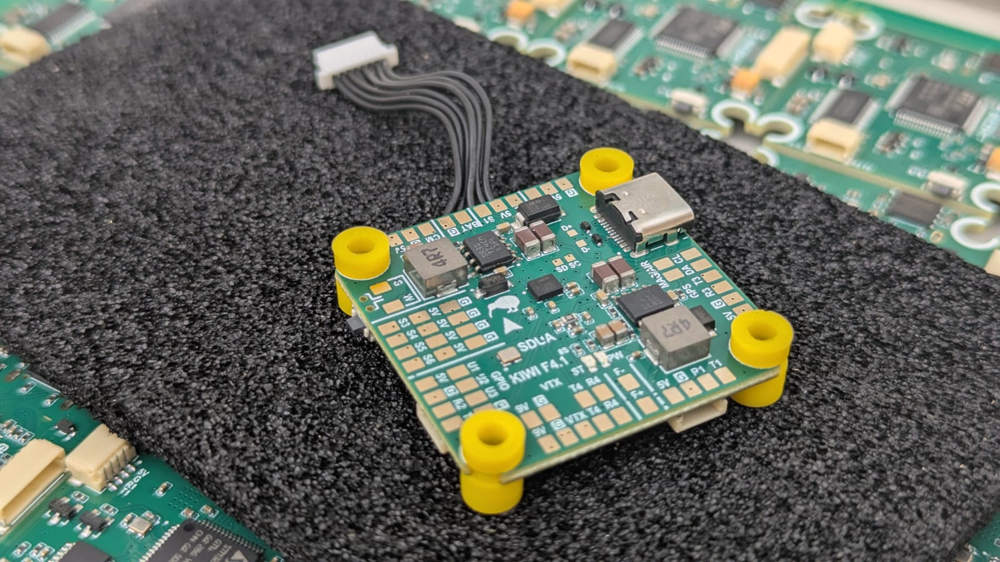
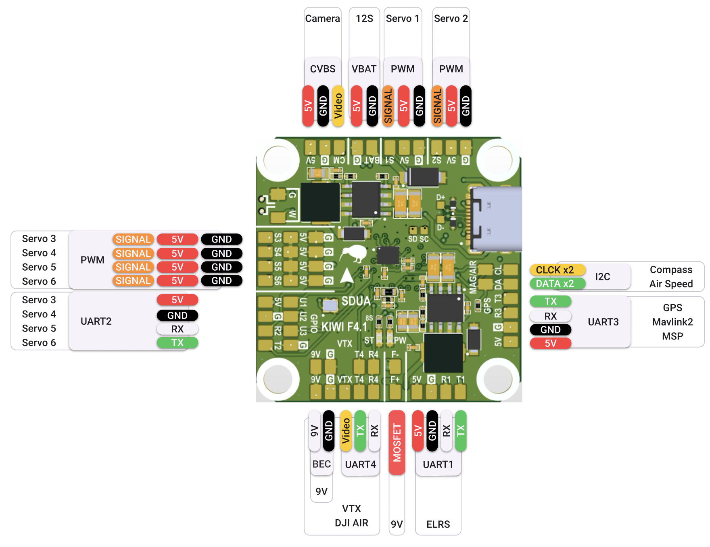
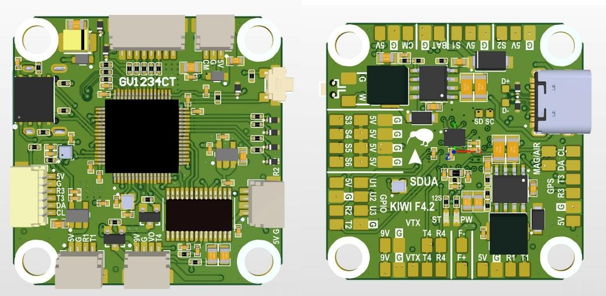

# Flight Controller Board: KIWI F405 12S Configuration

## Description

KIWI F4.0 is a versatile flight controller based on the STM32F405, designed for FPV, wings, and autonomous platforms.  
The controller combines precision inertial sensing, OSD support, built-in Blackbox, and relay outputs for controlling
external modules.  
Support for both Betaflight and ArduPilot allows this board to be used in a wide range of applications.

KIWI F4.0 is a reliable platform for building FPV drones, aircraft, and specialized autonomous systems with full support
for Betaflight and ArduPilot.  
Thanks to flexible relay, sensor, and telemetry connectivity, the controller is ready for real-world mission use.

## Firmware
- ArduPilot 4.6.2 [KiwiF405-12S.zip](download/KiwiF405-12S.zip)
- Betaflight 4.5.3 [BF-4.5.3.zip](download/battle_flight/betaflight_4.5.3_STM32F405_KAPONGA_KIWIF4_12S.hex.zip)
- Betaflight 2025.12.0 [BF-2025.12.0-beta.zip](download/betaflight_2025.12.0-beta_STM32F405_KAPONGA_KIWIF4_12S.hex.zip)

## Pinout and Diagrams

[(Click to zoom in)](kiwif405.png)

## Features

- Industrial-grade IMU Invensense ICM-42688P with external clock
- Bosch BMP388 barometer for altitude measurement
- Integrated 128Mbit Blackbox flash memory (W25Q128FV)
- MAX7456 OSD chip for overlaying telemetry on analog video
- High-precision voltage and current monitoring via ADC (VBAT, CURRENT)
- GPIO-controlled relay outputs for powering VTX, cameras, or pyrotechnic systems
- 4 motor PWM outputs + 6 servo channels
- USB Type-C with DFU firmware flashing support
- Full CRSF / ELRS telemetry support (RSSI, LQ, SNR, Power)

## Technical Specifications

- MCU: STM32F405RG (168 MHz)
- IMU: ICM-42688P with external oscillator
- Barometer: Bosch BMP388
- OSD: MAX7456
- Flash Memory: W25Q128FV (128 Mbit)
- Ports:
    - 5x UART (ESAD, RC, GPS, VTX, ESC/MSP)
    - 1x I2C
    - 3x SPI (OSD, IMU, FLASH)
    - ADC: VBAT, CURR
- PWM:
    - 4 motor channels
    - 6 servo channels
- GPIO Relays:
    - **U1, U2, U3, F+, F- (controlled via GPIO)**
- Interfaces:
    - USB Type-C
    - SWD for debugging
- Dimensions:
    - 36×36 mm
    - Mounting: 30.5×30.5 mm
- LED: Heartbeat 
