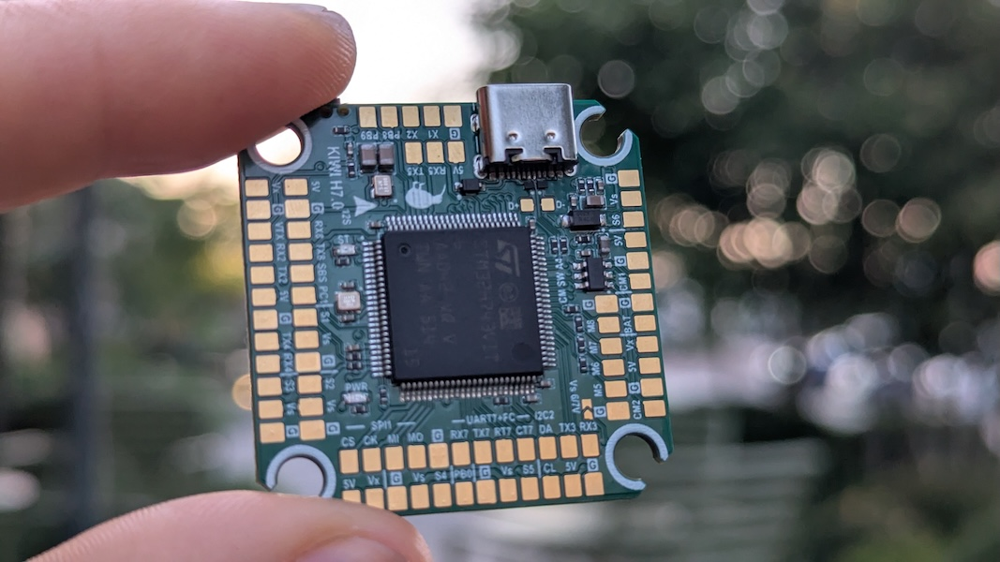
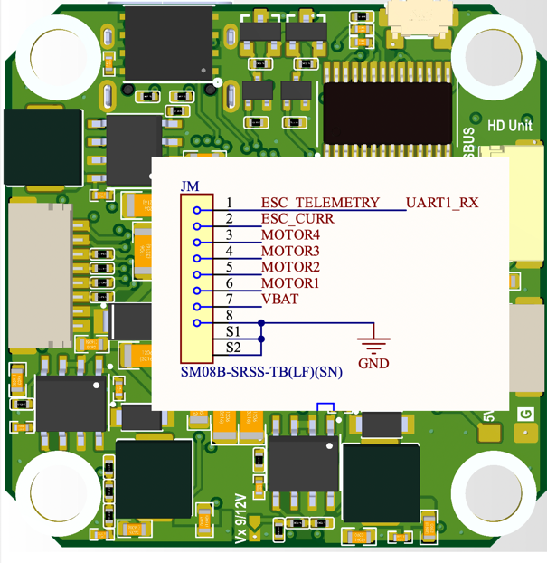

# KiwiH743 12S Flight Controller



## Overview

The **KiwiH743** is a high-performance flight controller based on the STM32H743 MCU, designed for advanced UAV
applications. It combines powerful processing, flexible connectivity, and rich sensor support, optimized for ArduPilot
firmware.

It is the next generation of the KiwiF405 family, offering 2MB flash, 480 MHz CPU clock, extended UART/SPI/I2C buses,
and support for dual IMUs, barometer, and OSD integration.

---

## Firmware

- ArduPilot [KiwiH743.zip](download/KiwiH743.zip)
- ArduPilot (SD card) [KiwiH743-sdcard.zip](download/KiwiH743-sdcard.zip)
- Betaflight

## Technical Specifications

### Processor, Memory, Clock

- MCU: STM32H743VIT6
- Architecture: ARM Cortex-M7
- Max Frequency: 480 MHz
- Flash: 2048 KB (2 MB)
- FPU: Single-precision, hardware accelerated
- Crystal Frequency: 16 MHz external oscillator
- DataFlash: 16 MB
- OSD Type: Integrated (MAX7456-compatible)
- External SD card slot via SPI

---

## Connectivity

### USB, UART, SPI Peripherals

- USB OTG1 (Mavlink)
- USB OTG2 HiSpeed (Serial)
- 7 hardware UARTs
- Dedicated functions:
    - UART8: RC input (SBUS/DSM)
    - Others available for GPS, telemetry, peripherals
- SPI1 bus available for external peripherals

---

## Sensors

- IMU1: ICM-42688P
- IMU2: ICM-45686
- Barometer: BMP388
- External compass support: yes (I²C probing enabled)

---

## GPIOs, Relays, and AUX

### Dedicated GPIO Pads

| Pad     | Pin | GPIO | Default    | ArduPilot Relay Config              |
|---------|-----|------|------------|-------------------------------------|
| CAM SW  | PA8 | 100  | RELAY1     | `RELAY1_PIN=100` (hwdef default)    |
| RELAY1  | PD4 | 101  | Output LOW | `RELAY2_PIN=101`, `RELAY2_FUNC=1`   |
| RELAY2  | PB7 | 102  | Output LOW | `RELAY3_PIN=102`, `RELAY3_FUNC=1`   |
| LED     | PE4 | 90   | Status LED | —                                   |

> **Note:** `RELAY1_PIN` defaults to GPIO 100 (Camera Switch pad, PA8), not the pad labeled "RELAY1" (PD4, GPIO 101). This is set in the hwdef. Adjust if your wiring differs.

### PWM Outputs

RC input: SBUS/DSM on PE11.

| Output | Pin  | GPIO | Timer     | Function  | DShot Bidir |
|--------|------|------|-----------|-----------|-------------|
| PWM1   | PC6  | 50   | TIM3_CH1  | Motor 1   | Yes         |
| PWM2   | PC7  | 51   | TIM3_CH2  | Motor 2   | Yes         |
| PWM3   | PC8  | 52   | TIM3_CH3  | Motor 3   | Yes         |
| PWM4   | PC9  | 53   | TIM3_CH4  | Motor 4   | Yes         |
| PWM5   | PD12 | 54   | TIM4_CH1  | Motor 5   | No          |
| PWM6   | PD13 | 55   | TIM4_CH2  | Motor 6   | No          |
| PWM7   | PD14 | 56   | TIM4_CH3  | Motor 7   | No          |
| PWM8   | PD15 | 57   | TIM4_CH4  | Motor 8   | No          |
| PWM9   | PA0  | 58   | TIM5_CH1  | Servo 1   | No          |
| PWM10  | PA1  | 59   | TIM5_CH2  | Servo 2   | No          |
| PWM11  | PA2  | 60   | TIM5_CH3  | Servo 3   | No          |
| PWM12  | PA3  | 61   | TIM5_CH4  | Servo 4   | No          |
| PWM13  | PE13 | 62   | TIM1_CH3  | Servo 5   | No          |
| PWM14  | PB8  | 63   | TIM16_CH1 | Servo 6   | No          |

PWM pins can be reassigned to GPIO via `SERVOn_FUNCTION=0` + `RELAYn_PIN=<gpio>`.

### Spare ADC

| Pin | Function |
|-----|----------|
| PC1 | SPARE2_ADC1 (analog input only) |

### Relay Usage

**MAVProxy:**
```
param set RELAY2_PIN 101
param set RELAY2_FUNC 1
relay set 0 1    # RELAY1 ON (CAM SW pad HIGH)
relay set 0 0    # RELAY1 OFF
relay set 1 1    # RELAY2 ON (RELAY1 pad HIGH)
```

**Mission waypoint:** `DO_SET_RELAY` — relay number 0-based (0=RELAY1), setting 1=ON / 0=OFF.

**Lua:**
```lua
relay:toggle(0)  -- toggle RELAY1 (CAM SW)
relay:on(1)      -- RELAY2 ON (RELAY1 pad)
relay:off(1)     -- RELAY2 OFF
```

All GPIO pads default LOW on boot. Use `RELAY_DEFAULT` params to set initial state.

---

## Power Monitoring

- Battery Voltage sense (12S)
- Battery Current sense (12S)
- Default monitor type: Analog

---

## Debug & Development

- SWD Pins:
    - `PA13`: JTMS-SWDIO
    - `PA14`: JTCK-SWCLK

---

## LEDs & Indicators

- Status LED: `PE4` (active-low)

---

## Advanced Features

- Visual odometry integration: enabled
- External AHRS support
- GPS moving baseline enabled
- Gyro FFT enabled (vibration analysis)
- INS temperature calibration enabled
- Guided (NoGPS) supported

---

## Default Frame & Modes

- Default frame: Quadcopter X (FRAME_TYPE=12, Betaflight-X motor order)
- Flight modes enabled by default:
    - Guided (NoGPS)
    - FlowHold
    - OpticalFlow

## Pinouts and schematics

### ESC Pins

    1 - ESC Telemetry
    2 - ESC Current
    3 - Motor4
    4 - Motor3
    5 - Motor2
    6 - Motor1
    7 - VBAT
    8 - GND


