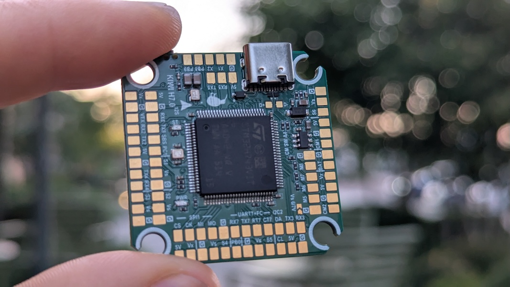
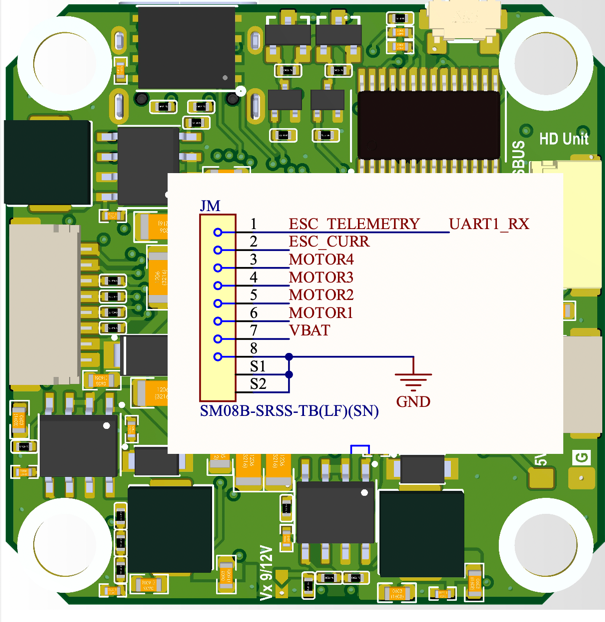

# KiwiH743 12S Flight Controller



<a href="https://kiwidrone.com.ua/kiwi-h743-fpv/" target="_blank" class="buy-online">Buy Online</a>
<a href="https://kiwidrone.com.ua/kiwi-h743-fpv/" target="_blank" class="buy-online-sticky">Buy Online</a>

## Overview

The **KiwiH743** is a high-performance flight controller based on the STM32H743 MCU, designed for advanced UAV
applications. It combines powerful processing, flexible connectivity, and rich sensor support, optimized for ArduPilot
firmware.

It is the next generation of the KiwiF405 family, offering 2MB flash, 480 MHz CPU clock, extended UART/SPI/I2C buses,
and support for dual IMUs, barometer, and OSD integration.

**Premium features:** GPS-less takeoff, IRC Tramp VTX control, VRX integration (TBS Fusion, Skyzone Steadyview).

---

## Firmware

- ArduPilot [KiwiH743.zip](download/KiwiH743.zip)
- ArduPilot (SD card) [KiwiH743-sdcard.zip](download/KiwiH743-sdcard.zip)
- Betaflight

## Features

- Dual IMUs: ICM-42688P + ICM-45686 with EKF3 dual-source fusion
- BMP388 barometer, external compass support (I²C probing)
- Integrated OSD (MAX7456-compatible via SPI4)
- 14 PWM outputs (8 motors + 6 servos), DShot bidirectional on M1–M4
- 7 hardware UARTs + 2 USB ports (OTG1 MAVLink, OTG2 HiSpeed serial)
- 16 MB DataFlash + external SD card slot
- Visual odometry, external AHRS, GPS moving baseline support
- Gyro FFT for vibration analysis
- INS temperature calibration
- Guided (NoGPS), FlowHold, OpticalFlow modes

## Technical Specifications

- MCU: STM32H743VIT6 (ARM Cortex-M7, 480 MHz, 2048 KB flash)
- Crystal: 16 MHz external oscillator
- IMU1: ICM-42688P (SPI6, rotation YAW_180)
- IMU2: ICM-45686 (SPI2, rotation YAW_270)
- Barometer: BMP388 (I2C2, address 0x76)
- OSD: MAX7456-compatible (SPI4)
- DataFlash: 16 MB (SPI3)
- LED: PE4 (active low)
- Dimensions: 36×36 mm, mounting 30.5×30.5 mm

---

## Serial Ports

| Port   | ArduPilot | Default Protocol   | Pins        | Notes                    |
|--------|-----------|--------------------|-------------|--------------------------|
| USB    | SERIAL0   | MAVLink            | PA11, PA12  | OTG1 Full Speed          |
| USART1 | SERIAL1   | ESC Telemetry (115200) | PA10    | RX only                  |
| USART2 | SERIAL2   | SmartAudio (115200)| PD5, PD6    | NODMA                    |
| USART3 | SERIAL3   | —                  | PD8, PD9    |                          |
| UART4  | SERIAL4   | —                  | PD1, PD0    |                          |
| UART5  | SERIAL5   | MAVLink1 (57600)   | PB6, PD2    | NODMA                    |
| UART7  | SERIAL7   | MAVLink2           | PE8, PE7    | RTS: PE9, CTS: PE10      |
| UART8  | SERIAL8   | RC Input           | PE1, PE0    | SBUS/DSM                 |
| USB HS | SERIAL9   | —                  |             | OTG2 HiSpeed             |

RC input: SBUS/DSM on PE11.

---

## GPIOs, Relays, and AUX

### Dedicated GPIO Pads

| Pad     | Pin | GPIO | Default    | ArduPilot Relay Config              |
|---------|-----|------|------------|-------------------------------------|
| CAM SW  | PA8 | 100  | RELAY1     | `RELAY1_PIN=100` (hwdef default)    |
| RELAY1  | PD4 | 101  | Output LOW | `RELAY2_PIN=101`, `RELAY2_FUNC=1`   |
| RELAY2  | PB7 | 102  | Output LOW | `RELAY3_PIN=102`, `RELAY3_FUNC=1`   |
| LED     | PE4 | 90   | Status LED | —                                   |

> **Note:** `RELAY1_PIN` defaults to GPIO 100 (Camera Switch pad, PA8), not the pad labeled "RELAY1" (PD4, GPIO 101). This is set in the hwdef. Adjust if your wiring differs.

### PWM Outputs

| Output | Pin  | GPIO | Timer     | Function  | DShot Bidir |
|--------|------|------|-----------|-----------|-------------|
| PWM1   | PC6  | 50   | TIM3_CH1  | Motor 1   | Yes         |
| PWM2   | PC7  | 51   | TIM3_CH2  | Motor 2   | Yes         |
| PWM3   | PC8  | 52   | TIM3_CH3  | Motor 3   | Yes         |
| PWM4   | PC9  | 53   | TIM3_CH4  | Motor 4   | Yes         |
| PWM5   | PD12 | 54   | TIM4_CH1  | Motor 5   | No          |
| PWM6   | PD13 | 55   | TIM4_CH2  | Motor 6   | No          |
| PWM7   | PD14 | 56   | TIM4_CH3  | Motor 7   | No          |
| PWM8   | PD15 | 57   | TIM4_CH4  | Motor 8   | No          |
| PWM9   | PA0  | 58   | TIM5_CH1  | Servo 1   | No          |
| PWM10  | PA1  | 59   | TIM5_CH2  | Servo 2   | No          |
| PWM11  | PA2  | 60   | TIM5_CH3  | Servo 3   | No          |
| PWM12  | PA3  | 61   | TIM5_CH4  | Servo 4   | No          |
| PWM13  | PE13 | 62   | TIM1_CH3  | Servo 5   | No          |
| PWM14  | PB8  | 63   | TIM16_CH1 | Servo 6   | No          |

PWM pins can be reassigned to GPIO via `SERVOn_FUNCTION=0` + `RELAYn_PIN=<gpio>`.

### Spare ADC

| Pin | Function |
|-----|----------|
| PC1 | SPARE2_ADC1 (analog input only) |

### Relay Usage

**MAVProxy:**
```
param set RELAY2_PIN 101
param set RELAY2_FUNC 1
relay set 0 1    # RELAY1 ON (CAM SW pad HIGH)
relay set 0 0    # RELAY1 OFF
relay set 1 1    # RELAY2 ON (RELAY1 pad HIGH)
```

**Mission waypoint:** `DO_SET_RELAY` — relay number 0-based (0=RELAY1), setting 1=ON / 0=OFF.

**Lua:**
```lua
relay:toggle(0)  -- toggle RELAY1 (CAM SW)
relay:on(1)      -- RELAY2 ON (RELAY1 pad)
relay:off(1)     -- RELAY2 OFF
```

All GPIO pads default LOW on boot. Use `RELAY_DEFAULT` params to set initial state.

---

## Power Monitoring

- Battery Voltage: PC5 (ADC1 IN8)
- Battery Current: PB1 (ADC1 IN5)
- Default monitor type: Analog

### Sensor Calibration

| Parameter | ArduPilot | Betaflight |
|-----------|-----------|------------|
| Voltage scale | `BATT_VOLT_MULT` = 21.0 | `voltage_meter_scale` = 210 |
| Current scale | `BATT_AMP_PERVLT` = 142.9 | `current_meter_scale` = 100 |

### Battery Voltage Thresholds (ArduPilot)

| Parameter | 6S | 8S | 12S |
|-----------|-----|-----|------|
| Full charge | 25.2 V | 33.6 V | 50.4 V |
| `BATT_ARM_VOLT` | 22.2 | 29.6 | 44.4 |
| `BATT_LOW_VOLT` | 21.0 | 28.0 | 42.0 |
| `BATT_CRT_VOLT` | 19.8 | 26.4 | 39.6 |

---

## Buses

### SPI

| Bus  | CLK | MISO | MOSI | Usage                     |
|------|-----|------|------|---------------------------|
| SPI1 | PA5 | PA6  | PA7  | SD Card (CS: PA4)         |
| SPI2 | PB13| PB14 | PB15 | IMU2 ICM-45686 (CS: PD10) |
| SPI3 | PC10| PC11 | PC12 | DataFlash (CS: PD3)       |
| SPI4 | PE2 | PE5  | PE6  | OSD MAX7456 (CS: PE3)     |
| SPI6 | PB3 | PB4  | PB5  | IMU1 ICM-42688P (CS: PC13)|

### I2C

| Bus  | SCL  | SDA  | Devices                            |
|------|------|------|------------------------------------|
| I2C2 | PB10 | PB11 | BMP388 (0x76), external compass    |

---

## Default Frame and Modes

- Default frame: Quadcopter X (FRAME_TYPE=3, BetaFlight-X motor order)
- Motor protocol: DShot (MOT_PWM_TYPE=5)
- BLHeli passthrough: enabled (SERVO_BLH_AUTO=1, mask=15)
- Flight mode channel: CH8
- VTX: enabled, band 6, channel 4

### Camera Gimbal Support

KiwiH743 supports camera gimbals out of the box — both servo-based and CADDX protocol gimbals.

#### CADDX Gimbal

Wire gimbal UART TX/RX/GND to any free serial port.

| Param | Value | Notes |
|-------|-------|-------|
| `SERIALx_PROTOCOL` | 8 | MAVLink |
| `SERIALx_BAUD` | 115 | 115200 bps |
| `MNT1_TYPE` | 13 | CADDX (reboot after setting) |
| `MNT1_PITCH_MIN` | -120 | GM3 V2 spec: ±120° |
| `MNT1_PITCH_MAX` | 120 | |
| `MNT1_YAW_MIN` | -160 | GM3 V2 spec: ±160° |
| `MNT1_YAW_MAX` | 160 | |
| `MNT1_ROLL_MIN` | -60 | GM3 V2 spec: ±60° |
| `MNT1_ROLL_MAX` | 60 | |
| `MNT1_RC_RATE` | 60 | deg/s for rate control, 0 for angle |

> Gimbal firmware must be V2.0 or higher.

#### Servo Gimbal

Connect pitch/yaw servos to any Servo PWM outputs (PWM9–PWM14).

| Param | Value | Notes |
|-------|-------|-------|
| `MNT1_TYPE` | 1 | Servo |
| `SERVOx_FUNCTION` | 6 | Mount1 Pitch (assign to desired output) |
| `SERVOx_FUNCTION` | 8 | Mount1 Yaw (assign to desired output) |
| `MNT1_PITCH_MIN` | -90 | |
| `MNT1_PITCH_MAX` | 90 | |
| `MNT1_YAW_MIN` | -170 | |
| `MNT1_YAW_MAX` | 170 | |
| `MNT1_RC_RATE` | 60 | deg/s for rate control, 0 for angle |

---

## Pinout Reference

### ESC Pins

    1 - ESC Telemetry
    2 - ESC Current
    3 - Motor4
    4 - Motor3
    5 - Motor2
    6 - Motor1
    7 - VBAT
    8 - GND


