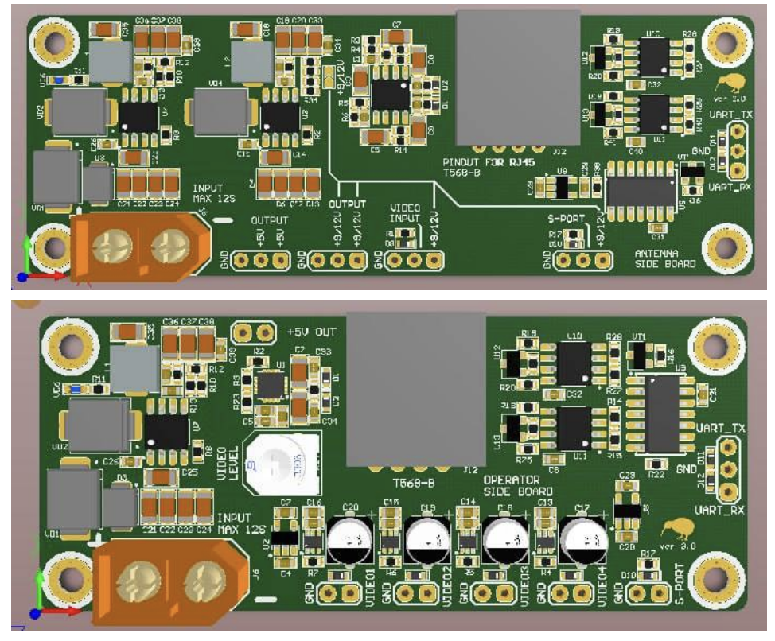

# Kiwi Ground Station Kit

## Призначення

Комплект наземної станції керування FPV дроном призначений для забезпечення безпеки операторів дронів.

Комплект є основою для побудови інфраструктури наземної станції.

## Склад

Комплект складається з двох основних плат:

- **Ground Board** (плата оператора) — 1 шт
- **Antenna Board** (плата щогли) — 1 шт
- **JR Board** (адаптер для підключення до пульта RC)
- **Технічна документація** — 1 шт
- *Кабель Cat5e або Cat6 не входить до комплекту*

Плата оператора розміщується у бліндажі або в пункті керування дронами.  
Плата щогли встановлюється поблизу антени.  
З’єднання між ними здійснюється екранованим кабелем “вита пара” довжиною до **300 м**.

## Функції

- Перетворення керуючого сигналу **S.Port** → **UART** і назад.
- Передача **аналогового відео CVBS** з VRX до бліндажу.
- **Підсилення відеосигналу** та його перетворення в цифровий потік.
- Живлення передавального модуля та VRX **до 26В**.

## Переваги Kiwi Ground Station Kit

- Надійна передача до **600 м** без ретрансляторів.
- Один кабель передає живлення, відео, та керування.
- Можливість живлення щогли локально або по кабелю.
- Вбудовані **DC-DC стабілізатори 5V, 9V, 12V** на щоглі.
- 4 відеовиходи без затримки.
- Підтримка **UART / CRSF**.
- Мінімальна кількість з’єднань.
- Робота в діапазоні температур **-20°C до +60°C**.

## Поширені сценарії використання

- Мобільні наземні станції для FPV-дронів
- Розвідувальні комплекси з щоглою до 10 м
- Модернізація старих систем зв’язку
- Системи спостереження у складних умовах

## Технічні характеристики

| Параметр                   | Значення                     |
|----------------------------|------------------------------|
| З’єднання між платами      | Екранована вита пара (T568B) |
| Максимальна довжина кабелю | до 300 м                     |
| Живлення по кабелю         | до 150 м без підвищення      |
| Робоча напруга живлення    | 3S–12S (12–50 В)             |
| Передача даних             | UART / CRSF                  |
| Передача відео             | CVBS (аналог)                |
| Відеовиходи                | 4 на Ground Board            |
| Робоча температура         | -20°C … +60°C                |
| Стабілізатори на щоглі     | 5V, 9V, 12V (DC-DC)          |

## Схема підключення

**Ground Board:**

- Video1 → FPV окуляри
- Video2 → Монітор
- Video3 → DVR
- Video4 → USB відео стрім (запис/трансляція)
- UART → Пульт або ПК

**Antenna Board:**

- TX (наприклад, ELRS TX)
- VRX (аналоговий приймач)

**Зʼєднання:**  
Ground Board ↔ Antenna Board через екранований кабель Cat5e/Cat6 до 300 м

## Живлення та втрати напруги

### Стабілізація на щоглі

На платі Antenna Board встановлені DC-DC перетворювачі:

- 5V — для VRX
- 9V — для спеціальних пристроїв
- 12V — для передавача

### Втрати на довгих кабелях (1А навантаження)

| Довжина | Втрати (6S) | Втрати (12S) | Напруга на щоглі (6S / 12S) |
|---------|-------------|--------------|-----------------------------|
| 100 м   | ~3.6 В      | ~3.6 В       | 21.6 В / 46.8 В             |
| 200 м   | ~7.2 В      | ~7.2 В       | 18.0 В / 43.2 В             |
| 300 м   | ~10.8 В     | ~10.8 В      | 14.4 В / 39.6 В             |

## Інструкція з експлуатації

1. Підключіть окуляри, монітор, DVR та USB відео стрім до Ground Board.
2. Підключіть пульт або ПК через UART.
3. Підключіть живлення 6S або 12S.
4. З’єднайте Ground ↔ Antenna через кабель.
5. Підключіть VRX та TX до Antenna Board.
6. Увімкніть систему.

## Рекомендації щодо прокладання і маскування кабелю

- Прокладати вздовж укриттів (дерева, рельєф, стіни).
- Уникати відкритих ділянок.
- Маскувати або фарбувати кабель.
- Фіксувати до землі або прокладати у кожусі.
- Біля щогли залишати запас.
- Перевіряти видимість з дронів.