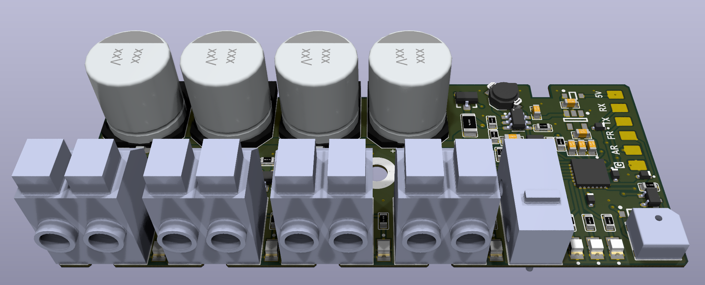

# Drobodrone: Плата для керування піротехнічними системами

## Купити: [на kiwidrone](https://kiwidrone.com.ua/drobodrone/)

## Опис

**Drobodrone** — це універсальна та безпечна плата для керування піротехнічними навантаженнями (парашути, феєрверки, маркери тощо), призначена для інтеграції у складі FPV, UAV та інших безпілотних систем. Підтримує до 4 незалежних каналів підриву з високим рівнем безпеки.

Плата підтримує багаторазове використання і може бути повністю перепрограмована для кастомних сценаріїв.

---

## Основні функції

- **4 незалежні канали підриву**  
  Призначені для запуску різних піротехнічних систем. Кожен канал має апаратний ключ для запобігання хибному спрацюванню.

- **Інтерфейси керування:**
  - **PWM IN x2:**  
    - *ARM:* активує систему (захист знято)  
    - *FIRE:* активує підрив (при активному ARM)
    - PWM активується при ширині імпульсу 1800–2000us
  - **UART (SmartESAD):**  
    - Для передачі телеметрії, контролю статусу та розширеного керування

- **Аудіо сигналізація:**  
  Вбудований динамік інформує про поточний статус (наприклад: озброєно, відмова, успішне спрацювання).

- **Світлова сигналізація:**  
  Три яскраві LED інформують про стан системи: Ready / Armed / Fired / Error

- **Механічна чека (запобіжник):**  
  Фізичне роз'єднання для запобігання спрацювання під час транспортування чи підготовки.

- **Інтерфейс живлення:**  
  - Живлення від 5V
  - Спрацювання елементів від 20V
  - Захист від перенапруги, короткого замикання

---

## Безпекові елементи

Система побудована за принципом *багаторівневого захисту*:

1. **Механічний вимикач-запобіжник** — фізично розриває ланцюг.
2. **PWM-сигнал типу ARM** — не дозволяє спрацювання без команди.
3. **Таймер самозахисту** — автоматичне вимкнення при відсутності FIRE протягом заданого часу.
4. **Апаратні ключі** — унеможливлюють коротке замикання або хибне спрацювання.
5. **Світлова та звукова індикація** — для візуального та звукового контролю статусу.

---

## Сумісність з автопілотами

Плата легко інтегрується з будь-яким автопілотом, який має PWM-виходи або UART-порти:

| Платформа     | Метод інтеграції                  |
|---------------|-----------------------------------|
| ArduPilot     | `SERVOx_FUNCTION = 94/95, 51-66`  |
| Betaflight    | `RESOURCE` + `SERVO` конфігурація |
| iNAV          | `Servo Mixer` + `Modes`           |
| INDI/Custom   | PWM або UART SmartESAD            |

> PWM-сигнал може бути поданий з пульта, автопілота або окремого модуля запуску.

---

## Роз'єми та підключення

- **Pyro Out x4:** спеціальні піротехнічні конектори
- **PWM IN x2:** пади для пайки
- **UART:** пади для пайки
- **5V In:** пади для живлення
- **GND, Status LED, Speaker:** окремі виходи

Плати мають великі, зручні контактні майданчики, які легко інтегрувати навіть у щільну проводку.

---

## Кастомізація

Плата підтримує:

- **Перепрошивку MCU** через стандартний bootloader
- **Зміну логіки ARM/FIRE**
- **Зміну таймерів, режимів індикації**
- **Підтримку альтернативних протоколів (за потреби)**

---

## Інтеграція: Швидкий старт

1. Підключіть 5V живлення та землю
2. Підключіть **PWM ARM** та **PWM FIRE** від автопілота
3. Підключіть піротехнічні канали
4. Встановіть механічну чеку
5. На землі подайте ARM > FIRE у потрібний момент
6. Перевірте LED та аудіо сигналізацію
7. Опціонально підключіть UART до Companion Computer або логера

---

## Примітка

Перед польотом завжди перевіряйте стан чека, сигналів, підключення піроканалів та акумулятора. Не залишайте плату в режимі ARM без нагляду.

---

## Індикатори станів. Керування
Комбінація помаранчевого 🟠 та зеленого діодів 🟢 – індикатор поточного стану плати.
 Червоний діод 🔴 сигналізує про помилку, яку має усунути оператор.
 Помилки можливі в будʼякому зі станів плати. Щоб плата могла перейти в наступний стан, спершу треба усунути всі помилки.

- 🔴🔴🔴🔴🔴🔴 (постійно світиться) – плата не отримує валідний **PWM ARM** чи **PWM ARM** сигнал, можливо проблема пайки зʼєднання з польотним контроллером.
- 🔴🔴⚪️⚪️🔴🔴 (повільно блимає, 1 раз на секунду, 1гц) – треба відтиснути **PWM ARM**.
- 🔴⚪️🔴⚪️🔴⚪️ (швидко блимає, 3 рази на секунду, 3гц) – треба відтиснути **PWM FIRE**.

**PWM**: 0 ≤ invalid < 900 ≤ valid=0 ≤ 1800 < valid=1 < 2000 ≤ invalid

Для початку роботи:
- плата має "бачити пульт": отримувати валідні **PWM ARM** та **PWM FIRE** (900 < pwm ширина < 2000)
- **PWM ARM** має бути у положені disarm (0, false, low, відтиснуте, вимкнене, ненатиснуте)
- **PWM FIRE** має бути у положені nofire (0, false, low, відтиснуте, вимкнене, ненатиснуте)
- вставити запобіжник (чеку)

Стани:

**(1) Безпечно. Вітання 🔔**:
 🔴🔴🔴🔴🔴🔴
 🟠🟠🟠🟠🟠🟠
 🟢🟢🟢🟢🟢🟢
 Триває секунду після подачі живлення, далі автоматично переходить в **(2) Очікую Запобіжник**

**(2) Безпечно. Очікую запобіжник**:
 ⚪️⚪️⚪️⚪️⚪️⚪️
 🟢⚪️🟢⚪️🟢⚪️
 Чекає поки оператор вставить чеку, далі переходить в **(3) Запобіжник**

**(3) Безпечно. Запобіжник**:
 ⚪️⚪️⚪️⚪️⚪️⚪️
 🟢🟢🟢🟢🟢🟢
 Чекає поки оператор усуне чеку, далі переходить в **(4) Таймер**

**(4) Безпечно. Таймер**:
 ⚪️⚪️⚪️⚪️⚪️⚪️
 🟢🟢⚪️⚪️🟢🟢
 Можливо вставити чеку щоб повернутись в **(3) Запобіжник**
 Триває 60 секунд. Дає час відійти після усунення чеки. Далі переходить в **(5) Очікую Заряд**

**(5) Уважно. Очікую Заряд**:
 🟠🟠⚪️⚪️🟠🟠
 Можливо вставити чеку щоб повернутись в **(3) Запобіжник**
 Чекає на **PWM ARM** від оператора, далі ~секунду заряджає 🔔 і переходить в **(6) Заряджено**

**(6) Небезпечно. Заряджено 🔔**:
 🟠⚪️🟠⚪️🟠⚪️
 Можливо вставити чеку щоб повернутись в **(3) Запобіжник**
 Відтисни **PWM ARM** щоб розрядити і повернутись в **(5) Очікую Заряд**
 Натисни **PWM FIRE** щоб зробити **(7) Постріл**.

**(7) Небезпечно. Постріл**:
 🔴🔴🔴🔴🔴🔴
 🟠🟠🟠🟠🟠🟠
 🟢🟢🟢🟢🟢🟢
 Постріл триває 100ms і автоматично переходить в **(5) Очікую Заряд**, який одразу переходить в **(6) Заряджено** якщо не відтискати **PWM ARM**.
 Задля безпеки, для наступного пострілу треба відтиснути **PWM FIRE**, про що нагадає помилка 🔴⚪️🔴⚪️🔴⚪️.
 4 незалежні канали підриву `1234` поділені на 2 групи по 2 канали в кожній `12 34`.
Постріл підриває поточну активну группу (2 канали одночасно), і готує наступну групу для наступного пострілу. I так по-колу. Тобто постріли `1 2 3 4 5 6` здетонують канали `12 34 12 34 12 34`.

Тобто послідовність роботи така:
 підготовка: power arm=0 fire=0 вставили_чеку вийняли_чеку 60сек
 робота: arm=1 fire=1 fire=0 fire=1
 додому: fire=0 arm=0
