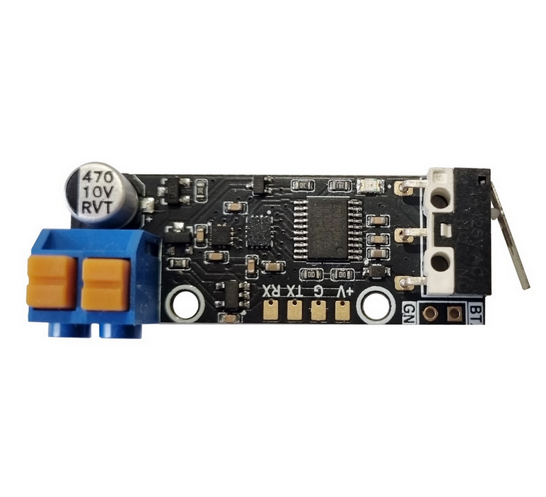

# Ініціатор для мін універсальний

## Призначення
Ініціатор споряджається у протитанкові або протипіхотні міни типу ПOM, ПМН-3, ОЗМ-72, МОН-50, ТМ-62, ПТМ-3, ПТМ-4 тощо.

### Основні задачі
- мінування під'їзних шляхів наступу ворожих військ;
- міна-пастка;
- підрив міни при скиді з БПЛА.

Електроніка міни забезпечує безпеку сапера, який встановлює міну вручну, або пілота дрона, який виконує віддалений скид міни, за рахунок двох (у випадку підключення приймача команд – трьох) запобіжників.

Міна проектується з метою унеможливити її знешкодження крім фізичного дистанційного знищення. Вона реагує на найменші рухи чи повороти корпусу, а також наближення феромагнітних предметів (бронежилет, зброя, інструменти тощо) при спробі знищення.

Електроніка може встановлюватись у корпуси стандартних серійних мін, щоб ворожий сапер вважав, що він має справу з відомою міною натискної дії (пастка для сапера).

Встановлення опційного приймача команд дозволяє підірвати міну при наближенні до місця її розташування групи ворожої піхоти чи техніки. При переході у наступ можливість віддаленого керування дозволяє оперативно розмінувати шлях наступу дружніх підрозділів.

## Переваги
- кілька датчиків цілі;
- можливість зміни програми відповідно до задач;
- віддалене керування (опція);
- неможливість деактивації без пульта;
- можливість пастки з відкладеним вибухом.

## Конструкція
- корпус;
- кришка;
- плата з електронними компонентами (16×44×10 мм);
- механічний запобіжник;
- елемент живлення;
- приймальна антена (опціонально);
- вибухова речовина;
- вражаючі елементи;
- електродетонатор.

## Датчики цілі
Спрацювання ініціатора відбувається у випадках:
- натискання (8–20 кг);
- замикання сухого контакту;
- переміщення, поворот або нахил міни;
- удар з будь-якого напрямку;
- спроба розібрати корпус;
- зміна магнітного поля, у тому числі наближення феромагнітних об’єктів та металошукачів;
- сигнал від пульта керування (опціонально);
- самознищення за таймером та при розряді батареї нижче критичного рівня.

Керування з пульта: напряму або через ретранслятор. Можливий вибірковий підрив або підрив групи мін.

## Запобіжники
- **Механічний** – чека.
- **Електронний** – таймер затримки зведення, програмується від 2 хвилин до кількох годин. Таймер обнуляється при найменших рухах міни. Для переведення у бойовий стан вимагається, щоб міна лежала нерухомо протягом усього часу роботи таймера. Це дозволяє витягнути чеку і встановлювати міну вручну або за допомогою дрона без ризику підриву.
- **Електронний** – активація з пульта (за наявності приймача).

## Живлення
- літієва батарея типу 18650 або 2–3 елементи АА/ААА;
- струм споживання – менше 1 мА;
- час безперервної роботи у режимі очікування: до 30 діб залежно від типу батареї;
- при комплектуванні приймачем команд – до 10 діб;
- можливе самознищення при падінні напруги нижче критичного рівня.

## Установка
- вручну;
- скид з БПЛА;
- доставка наземним дроном.

## Принцип роботи
Після установки або скиду, акселерометр та магнетометр запам’ятовують поточне положення міни відносно вектора прискорення та магнітного поля Землі.

- Зміна положення фіксується акселерометром,
- поворот – гіроскопом,
- зміна магнітного поля – магнетометром.

Перевищення встановлених порогів призводить до підриву.

## Заплановані удосконалення у версії 2.0
- інтегрований приймач команд у складі плати;
- покращений алгоритм енергозбереження;
- нові батареї типу LiCOCl₂ з температурним діапазоном від -60 до +80 °C та строком зберігання до 10 років.

---

# Universal initiator for land mines **PyroMine**

## Purpose
The initiator is designed for anti-tank and anti-personnel mines such as POM, PMN-3, OZM-72, MON-50, TM-62, PTM-3, PTM-4, etc.

### Main tasks
- mining the supply lines of enemy troops;
- trap mine;
- detonation of a mine when dropped from a UAV.

The electronics ensure the safety of the sapper who installs the mine manually or the UAV pilot who performs the drop, thanks to two fuses (or three with command receiver).

The initiator is designed to make neutralization impossible except by remote destruction. It reacts to even slight movements, tilts, or the approach of ferromagnetic objects.

It can be mounted into standard mine bodies so that enemy sappers mistake it for a known pressure mine (booby trap).

With an optional command receiver, the mine can be detonated upon the approach of enemy infantry or vehicles. During an offensive, remote control allows quick clearance of friendly paths.

## Advantages
- multiple target sensors;
- reprogrammable for specific missions;
- remote control (optional);
- impossible to deactivate without remote unit;
- trap with delayed explosion.

## Design
- body;
- cover;
- PCB with electronics (16×44×10 mm);
- mechanical fuse;
- battery;
- receiving antenna (optional);
- explosive charge;
- fragments;
- electric detonator.

## Target sensors
The initiator is triggered by:
- pressing (8–20 kg);
- dry contact closing;
- moving, turning or tilting the mine;
- impact from any direction;
- disassembly attempt;
- magnetic field changes (ferromagnetic objects, metal detectors);
- remote signal (optional);
- self-destruction on timer or low battery.

Remote control: direct or via repeater. Selective or grouped detonation.

## Fuses
- **Mechanical** – safety pin.
- **Electronic** – arming delay timer (2 minutes to several hours). Reset on any movement, requires the mine to stay still to arm.
- **Electronic** – remote activation (if receiver is installed).

## Power
- lithium 18650 or 2–3 AA/AAA cells;
- consumption <1 mA;
- standby operation up to 30 days;
- with command receiver – up to 10 days;
- optional self-destruction at critical voltage.

## Deployment
- manual;
- UAV drop;
- ground drone delivery.

## Operation principle
After deployment, the accelerometer and magnetometer record initial orientation and field values.

- accelerometer detects movement,
- gyroscope detects rotation,
- magnetometer detects magnetic changes.

Threshold exceedance results in detonation.

## Planned improvements in version 2.0
- integrated command receiver on PCB;
- enhanced power-saving algorithms;
- new LiCOCl₂ batteries with -60 to +80 °C operating range and 10-year shelf life.  