# ICM-42688P — 6-Axis Inertial Sensor Module

**Manufacturer:** Shenzhen HuaXuanYang (HXY) Electronics CO., LTD
**Website:** www.hxymos.com

---

## Description

The ICM-42688P is a highly integrated, low-power inertial measurement unit (IMU) with a built-in high-performance 3-axis accelerometer and 3-axis gyroscope measurement unit. The accelerometer full-scale range is +/-2g/+/-4g/+/-8g/+/-16g. The gyroscope angular rate full-scale range is +/-125dps/+/-250dps/+/-500dps/+/-1000dps/+/-2000dps. Users can flexibly measure external acceleration and angular velocity, with accelerometer output data rate from 0.78 Hz to 1.6 kHz selectable, and gyroscope output data rate from 25 Hz to 3.2 kHz selectable.

The chip communicates with the MCU via I2C/SPI interface. Accelerometer and gyroscope measurement data can be obtained by interrupt or polling. INT1 and INT2 interrupt pins provide various internal auto-detection interrupt signals for diverse motion detection scenarios, enabling reliable motion detection, attitude estimation, and gesture recognition at extremely low system power. Interrupt sources include 6D/4D orientation detection, free-fall detection, sleep and wake detection, single-tap and multi-tap detection, step counting, pedometer, and OIS function interrupts, as well as temperature detection interrupts.

The chip has a built-in high-precision calibration reference and an internal LDO circuit. At different supply voltages, zero drift remains more stable, correcting sensor gain errors and gain mismatch for precise angle-to-angle conversion testing. The chip has a built-in self-test function that allows customer system testing to detect system functionality, eliminating complex angle-to-angle conversion testing.

The ICM-42688P is applicable to smartphones, drones, game controllers, various IoT, and smart hardware systems. It supports mainstream operating systems for micro-step and motion capture screen functionality, and provides drones, game controllers, VR, and AR algorithm support.

## Key Features

- Analog supply voltage range: 1.71~3.6V
- Low-power mode total combined supply current: 399uA
- High-performance mode total combined supply current: 927uA
- Accelerometer and gyroscope 16-bit data output
- I2C/SPI digital output interface
- Built-in temperature sensor
- 6D/4D orientation detection, tilt detection/angle detection, static and motion detection
- Sleep and wake detection, free-fall detection, single-tap and multi-tap detection
- SensorTime function
- OIS function (ODR=6.4kHz)
- Programmable interrupt generation circuit
- Built-in programmable step counter detection, built-in programmable wrist tilt recognition, built-in self-test function
- Built-in FIFO
- 10,000g high shock resistance
- EU-compliant lead-free package, environmentally friendly

## Applications

- AR/VR devices
- Smartphones and tablets
- Smart wearable devices
- Head-mounted device accessories
- Attitude detection equipment
- Image rotation scene switching
- Strike detection scene activation
- Motion detection devices
- 9D orientation detection scenarios
- Gesture recognition scenarios
- Vibration detection and compensation scenarios
- Indoor navigation / pedestrian path tracking / positioning scenarios
- 3D scanning / indoor mapping / SLAM scenarios
- Virtual reality games
- Mouse / game controllers
- IoT application scenarios
- Optical image stabilization for cameras
- Toy drones

## Product Classification

| Product Name | Package Type | Material | Packaging |
|---|---|---|---|
| ICM-42688P | LGA-14-2.5x3x1.00 | Lead-free | Tape and reel |

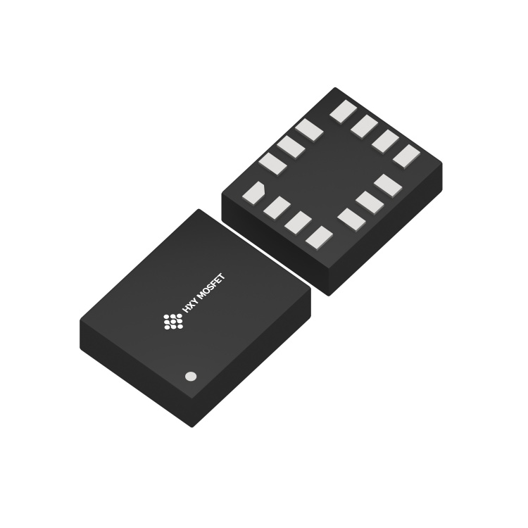

---

## Internal Block Diagram

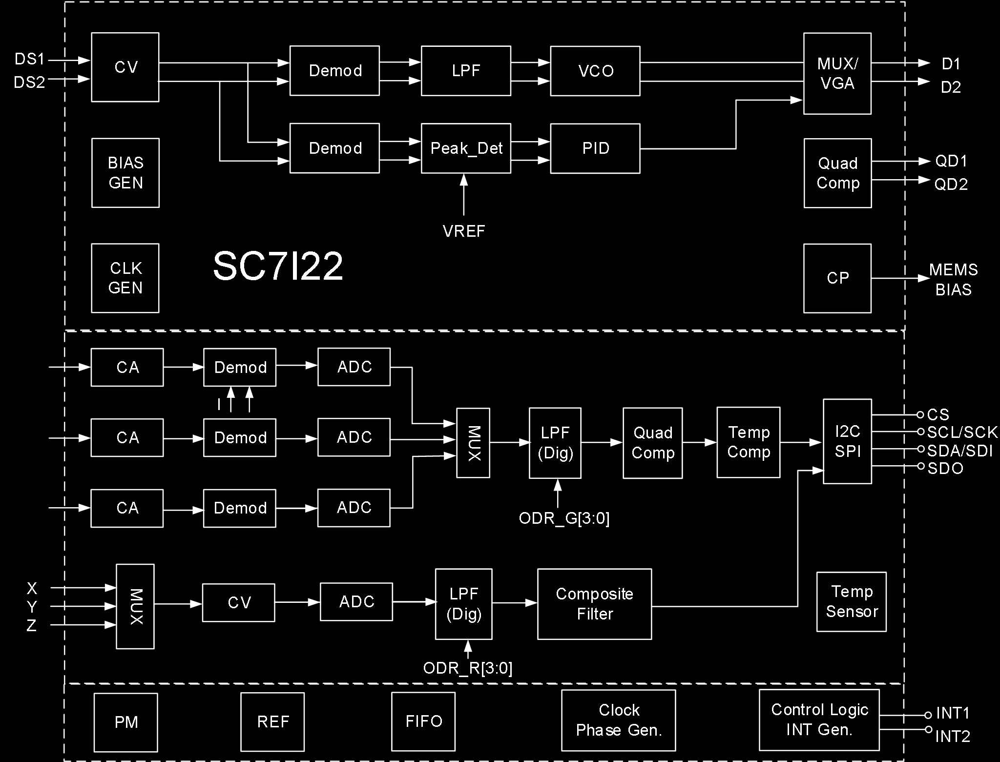

The internal architecture includes:
- MEMS gyroscope drive (CV, Demod, LPF, VCO, MUX/VGA) with quadrature compensation
- MEMS accelerometer sensing (CA channels for X/Y/Z with Demod and ADC)
- Gyroscope sensing (CV + ADC for X/Y/Z axes)
- Digital LPF, Composite Filter
- Temperature compensation and sensor
- I2C/SPI interface (CS, SCL/SCK, SDA/SDI, SDO)
- Clock generator, Phase generator
- FIFO, Power Management (PM), Reference (REF)
- Control Logic and Interrupt Generation (INT1, INT2)
- BIAS generator, Charge Pump (CP)

---

## Absolute Maximum Ratings

| Parameter | Symbol | Test Conditions | Min | Max | Unit |
|---|---|---|---|---|---|
| Supply Voltage | VDD/VDDIO | No circuit damage | -0.3 | 3.6 | V |
| Any Control Pin | V_in | No circuit damage (CS/SDO/SCL/SDA/INT1/INT2) | -0.3 | VDDIO+0.3 | V |
| Operating Temperature | T_OPR | No circuit damage | -40 | +85 | degC |
| Storage Temperature | T_STG | No circuit damage | -55 | +150 | degC |
| ESD | HBM | -- | -- | 4 | kV |
| ESD | CDM | -- | -- | 1.5 | kV |

---

## Pin Description

Package: LGA14-2.5x3x1.00mm3

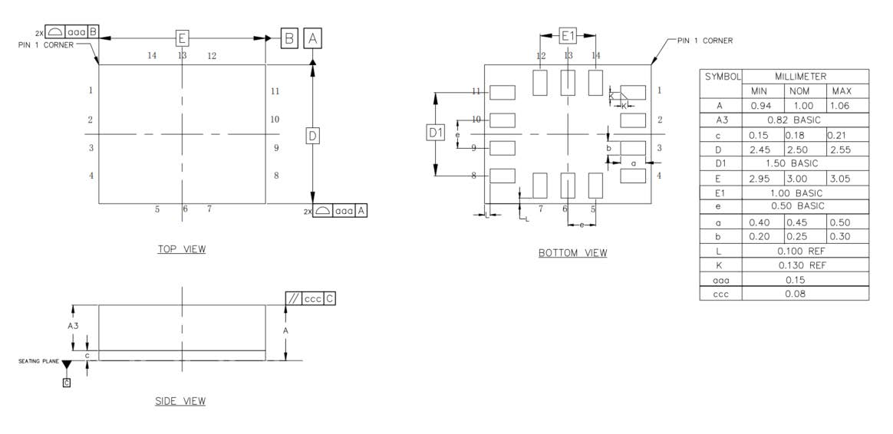

### Acceleration Direction
X, Y, Z axes as marked on package (pin 1 indicator dot at corner).

### Gyroscope Direction (top view)
+Omega_X, +Omega_Y, +Omega_Z rotation axes as marked.

### Pin Table

| Pin # | Name | I/O Type | Description |
|---|---|---|---|
| 1 | SDO/SA0 | I/O | SPI 4-wire interface data output SDO; I2C device address LSB SA0 |
| 2 | ASDx | I/O | OIS interface |
| 3 | ASCx | O | OIS interface |
| 4 | INT1 | I/O | Interrupt 1 |
| 5 | VDDIO | S | Digital power supply |
| 6 | GNDIO | GND | Ground |
| 7 | GND | GND | Ground |
| 8 | VDD | S | Analog power supply |
| 9 | INT2 | I/O | Interrupt 2 |
| 10 | OCSB | I/O | OIS interface |
| 11 | OSDO | I/O | OIS interface |
| 12 | CSB | I | I2C and SPI select: 1 = I2C; 0 = SPI |
| 13 | SCX | I | I2C clock SCL; SPI clock SPC |
| 14 | SDX | I/O | I2C data SDA; SPI data input SDI; 3-wire SPI data output SDO |

---

## Mechanical Parameters — Accelerometer (VDD=1.8V, T_A=25degC)

| Parameter | Symbol | Test Conditions | Min | Typical | Max | Unit |
|---|---|---|---|---|---|---|
| Accelerometer Full-Scale Range | AF_S0 | A_FS=0 | -- | +/-2.0 | -- | g |
| | AF_S1 | A_FS=1 | -- | +/-4.0 | -- | g |
| | AF_S2 | A_FS=2 | -- | +/-8.0 | -- | g |
| | AF_S3 | A_FS=3 | -- | +/-16.0 | -- | g |
| Accelerometer Sensitivity (16-bit) | ASo0 | A_FS=0 | -- | 0.061 | -- | mg/digit |
| | ASo1 | A_FS=1 | -- | 0.122 | -- | mg/digit |
| | ASo2 | A_FS=2 | -- | 0.244 | -- | mg/digit |
| | ASo3 | A_FS=3 | -- | 0.488 | -- | mg/digit |
| Accelerometer Sensitivity Error | AS_ERR | A_FS=0 | -- | +/-2 | -- | % |
| Accelerometer Temperature Sensitivity Coefficient | AT_CSO | A_FS=0, -40degC~85degC vs T=25degC diff | -- | +/-0.01 | -- | %/degC |
| Accelerometer Zero Drift | ATY_Off | A_FS=0, socket pressure test | -- | +/-80 | -- | mg |
| Accelerometer Zero Drift Temperature Coefficient | ATC_off | Max deviation from 25degC | -- | +/-1 | -- | mg/degC |
| Accelerometer Non-Linearity | ANL | Best fit line, A_FS=2 | -- | 0.5 | -- | %FS |
| Accelerometer Power Supply Rejection Ratio | APSRR | T_A=25degC | -- | +/-0.2 | -- | mg/V |
| Accelerometer Cross-Axis Interference | AS_X | A_FS=0, interference between any two of three axes | -- | 2 | -- | % |
| Accelerometer Output Noise 1 | ARMS1 | A_FS=0, A_ODR=100Hz, High-perf mode, OSR4_AVG1 | -- | 0.6 | -- | mg |
| Accelerometer Output Noise 2 | ARMS2 | A_FS=0, A_ODR=100Hz, Low-power mode, OSR4_AVG1 | -- | 4.5 | -- | mg |
| Accelerometer Output Data Rate | AODR_A,H | High-performance mode | 12.5 | -- | 1600 | Hz |
| | AODR_A,LPM | Low-power mode | 0.78 | -- | 800 | Hz |
| Accelerometer System Bandwidth | ABW | -- | ODR/3 | -- | ODR/2 | Hz |
| Accelerometer Self-Test Output | AV_st1 | A_FS=3, X-axis, high-freq oscillation, absolute value of positive/negative amplitude difference | -- | 6 | -- | g |
| | AV_st2 | A_FS=3, Y-axis, same | -- | 6 | -- | g |
| | AV_st3 | A_FS=3, Z-axis, same | -- | 8 | -- | g |
| Accelerometer Operating Temperature | AT_OPR | -- | -40 | -- | +85 | degC |

**Note:** Circuit is factory calibrated at 1.8V. Actual operating voltage is 1.71V-3.6V.

---

## Mechanical Parameters — Gyroscope (VDD=1.8V, T_A=25degC)

| Parameter | Symbol | Test Conditions | Min | Typical | Max | Unit |
|---|---|---|---|---|---|---|
| Gyroscope Full-Scale Range | GF_S0 | G_FS=+/-125dps | -- | +/-125 | -- | dps |
| | GF_S1 | G_FS=+/-250dps | -- | +/-250 | -- | dps |
| | GF_S2 | G_FS=+/-500dps | -- | +/-500 | -- | dps |
| | GF_S3 | G_FS=+/-1000dps | -- | +/-1000 | -- | dps |
| | GF_S4 | G_FS=+/-2000dps | -- | +/-2000 | -- | dps |
| Gyroscope Sensitivity (16-bit) | GSo0 | G_FS=+/-125dps | -- | 3.8125 | -- | mdps/LSB |
| | GSo1 | G_FS=+/-250dps | -- | 7.625 | -- | mdps/LSB |
| | GSo2 | G_FS=+/-500dps | -- | 15.25 | -- | mdps/LSB |
| | GSo3 | G_FS=+/-1000dps | -- | 30.5 | -- | mdps/LSB |
| | GSo4 | G_FS=+/-2000dps | -- | 61 | -- | mdps/LSB |
| Gyroscope Temperature Sensitivity Coefficient | GT_CSO | G_FS=+/-2000dps, -40deg~85deg vs T=25deg diff | -- | +/-0.05 | -- | %/degC |
| Gyroscope Sensitivity Error | GS_ERR | G_FS=+/-2000dps, calibrated | -- | +/-1.5 | -- | % |
| Gyroscope Zero Drift | GTY_Off | G_FS=+/-2000dps, socket pressure test | -- | +/-0.2 | -- | dps |
| Gyroscope Zero Drift Temperature Coefficient | GTC_off | G_FS=+/-2000dps, max deviation from 25degC | -- | +/-0.05 | -- | dps/degC |
| Gyroscope Non-Linearity | GNL | Best fit line, G_FS=+/-2000dps | -- | 0.1 | -- | %FS |
| Gyroscope Cross-Axis Interference | GS_X | G_FS=+/-2000dps | -- | 2 | -- | % |
| Gyroscope Noise Density | GN | G_FS=+/-2000dps, high-perf mode, GYR_BWP[1:0]=00 | -- | 6 | -- | mdps/sqrt(Hz) |
| Gyroscope Output Data Rate | GODR_G,HN | High-perf / Normal mode | 25 | -- | 3200 | Hz |
| | GODR_G,LPM | Low-power mode | 25 | -- | 800 | Hz |
| Operating Temperature | T_OPR | -- | -40 | -- | +85 | degC |

**Note:** Circuit is factory calibrated at 1.8V. Actual operating voltage is 1.71V-3.6V.

---

## Electrical Parameters (VDD=1.8V, T_A=25degC)

| Parameter | Symbol | Test Conditions | Min | Typical | Max | Unit |
|---|---|---|---|---|---|---|
| Supply Voltage | V_DD | -- | 1.71 | 1.8 | 3.6 | V |
| IO Supply Voltage | V_DDIO | -- | 1.62 | -- | 3.6 | V |
| Power Consumption | I_DD | A+G High-perf mode, VDD=1.8V, T_A=25degC, ODR_1.6kHz | -- | 927 | -- | uA |
| | | A+G Normal mode, VDD=1.8V, T_A=25degC, ODR_1.6kHz | -- | 670 | -- | uA |
| | | A+G Low-power mode, VDD=1.8V, T_A=25degC, ODR_25Hz | -- | 399 | -- | uA |
| | | A-only High-perf mode, VDD=1.8V, T_A=25degC, ODR_1.6kHz | -- | 299 | -- | uA |
| | | A-only Low-power mode, VDD=1.8V, T_A=25degC, ODR_25Hz | -- | 13.3 | -- | uA |
| | | A+G Off (shutdown), VDD=1.8V, T_A=25degC | -- | 6 | -- | uA |
| Power-Down Current | I_DDPdn | -- | -- | 6 | -- | uA |
| Digital High-Level Input Voltage | V_IH | -- | 0.8*V_DDIO | -- | -- | V |
| Digital Low-Level Input Voltage | V_IL | -- | -- | -- | 0.2*V_DDIO | V |
| High-Level Output Voltage | V_OH | -- | 0.9*V_DDIO | -- | -- | V |
| Low-Level Output Voltage | V_OL | -- | -- | -- | 0.1*V_DDIO | V |
| Startup Time | T_on | ODR=100Hz | -- | 50 | -- | ms |
| Operating Temperature | T_opr | -- | -40 | -- | +85 | degC |

---

## I2C Control Interface Parameters (=1.8V, TA=25degC)

| Parameter | Symbol | I2C Standard Mode | | I2C Fast Mode | | Unit |
|---|---|---|---|---|---|---|
| | | MIN | MAX | MIN | MAX | |
| SCL Clock Frequency | f_(SCL) | 0 | 100 | 0 | 400 | kHz |
| SCL Clock Low Time | t_w(SCLL) | 4.7 | -- | 1.3 | -- | us |
| SCL Clock High Time | t_w(SCLH) | 4.0 | -- | 0.6 | -- | us |
| SDA Setup Time | t_su(SDA) | 250 | -- | 100 | -- | ns |
| SDA Data Hold Time | t_h(SDA) | 0.01 | 3.45 | 0.01 | 0.9 | us |
| SDA/SCL Rise Time | t_r(SDA), t_r(SCL) | -- | 1000 | 20+0.1C_b | 300 | ns |
| SDA/SCL Fall Time | t_f(SDA), t_f(SCL) | -- | 300 | 20+0.1C_b | 300 | ns |
| START Condition Hold Time | t_h(ST) | 4 | -- | 0.6 | -- | us |
| Repeated START Condition Setup Time | t_su(SR) | 4.7 | -- | 0.6 | -- | us |
| STOP Condition Setup Time | t_su(SP) | 4 | -- | 0.6 | -- | us |
| Bus Idle Time | t_w(SP:SR) | 4.7 | -- | 1.3 | -- | us |

---

## SPI Serial Peripheral Interface Parameters (V_DD=1.8V, T_A=25degC)

| Parameter | Symbol | Test Conditions | Min | Typical | Max | Unit |
|---|---|---|---|---|---|---|
| SPI Clock Period | T_c(SPC) | | 100 | -- | -- | ns |
| SPI Clock Frequency | F_c(SPC) | | -- | -- | 10 | MHz |
| CS Setup Time | T_su(CS) | | 5 | -- | -- | ns |
| CS Hold Time | T_h(CS) | | 8 | -- | -- | ns |
| SDI Input Setup Time | T_su(SI) | | 5 | -- | -- | ns |
| SDI Input Hold Time | T_h(SI) | | 15 | -- | -- | ns |
| SDO Valid Output Time | T_v(SO) | | -- | -- | 50 | ns |
| SDO Output Hold Time | T_h(SO) | | 6 | -- | -- | ns |

**Note:** 10 MHz clock rate.

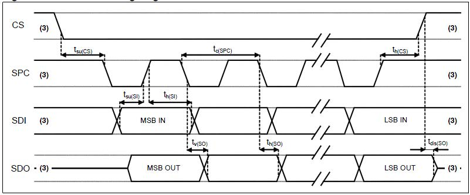

---

## Functional Description

### 1. Terminology

### 1.1 Sensitivity

**Accelerometer Sensitivity:** The physical quantity describing accelerometer gain, expressed as half the maximum digital output when +/-1G acceleration input is applied. In practice, gravity acceleration is used for measurement. Align the axis under test perpendicular to the ground, record the circuit output value A1, then rotate the axis 180 degrees on any plane, record the output value A2. Compute |A2-A1|, divide by 2, and the result is that axis's sensitivity. This value varies very little with temperature and time. Another parameter, "sensitivity error," describes the overall circuit sensitivity range consistency.

**Gyroscope Sensitivity:** The physical quantity describing gyroscope gain, obtainable by adding a given angular velocity. This sensitivity varies very little with temperature and time. When the sensor rotates counter-clockwise, the axis corresponds to positive digital output.

### 1.2 Zero Drift

**Accelerometer Zero Drift (Zero-g):** The deviation between the actual output signal and the ideal output signal when no acceleration is present. On a level surface, the ideal accelerometer output should be 0g for X and Y axes, and 1g for the Z axis. These outputs should be at the center of their respective dynamic ranges; however, in practice there is always deviation — this is the so-called Zero-g offset.

Zero-drift offset is fundamentally a manifestation of MEMS sensors experiencing stress conditions. When a sensor is mounted on a PCB or placed under large-scale mechanical stress, the zero offset will change slightly. Zero offset temperature variation is relatively small. The accelerometer zero-offset tolerance is a batch-level standard deviation of accelerometer sensor zero-offset values.

**Gyroscope Zero Drift (Zero-Rate):** The deviation of the actual output signal when no angular rate is present. Similarly, this zero offset is a manifestation of MEMS sensors experiencing stress. When mounted on a PCB or placed under mechanical stress, the zero offset will change slightly. Zero offset varies little with temperature and time.

### 1.3 Self-Test

**Accelerometer Self-Test:** The self-test function allows testing the mechanical part of the accelerometer without physical motion. The self-test bit is set to "0" to disable self-test. When set to "1," a driving force is applied to the MEMS mechanical mass, simulating a specific acceleration input. The circuit then outputs external acceleration plus electrostatic drive acceleration data. If the self-test output signal change is within the range specified in this datasheet, the circuit is functioning normally. See register descriptions below for setup details.

**Gyroscope Self-Test:** The gyroscope self-test function checks the stability of the gyroscope's drive amplitude, frequency, and drive control loop. It can detect particle contamination, mechanical damage, or stress loss. After initiating gyroscope self-test, the GYR_MEMS_OK result determines whether the gyroscope self-test passed. See register descriptions below for setup details.

---

## 2. Operating Mode Description

### 2.1 Operating Modes

The ICM-42688P has three selectable operating modes:

1. Accelerometer only active, gyroscope off
2. Gyroscope only active, accelerometer off
3. Both gyroscope and accelerometer active simultaneously, with independent ODRs

### 2.2 Accelerometer Operating Modes

In the ICM-42688P, the accelerometer can be configured into three different operating modes: Off, Low-Power, and High-Performance.

### 2.3 Gyroscope Operating Modes

In the ICM-42688P, the gyroscope can be configured into four different operating modes: Off, Low-Power, Normal, and High-Performance.

### 2.4 Operating Mode Settings

| Mode | Sensor Type | ACC_EN | GYR_EN | ACC_FILTER_PERF | GYR_FILTER_PERF | GYR_NOISE_PERF |
|---|---|---|---|---|---|---|
| Standby | -- | 0 | 0 | X | X | X |
| Low-Power | Accelerometer | 1 | 0 | X | X | X |
| | Gyroscope | 0 | 1 | X | 0 | 0 |
| | IMU | 1 | 1 | 0 | 0 | 0 |
| Normal | Accelerometer | 1 | 0 | 1 | X | X |
| | Gyroscope | 0 | 1 | X | 1 | 0 |
| | IMU | 1 | 1 | 1 | 1 | 0 |
| High-Performance | Accelerometer | 1 | 0 | 1 | X | X |
| | Gyroscope | 0 | 1 | X | 1 | 1 |
| | IMU | 1 | 1 | 1 | 1 | 1 |

---

## 3. Digital Interface

The ICM-42688P internal registers can be accessed via I2C and SPI serial interfaces. The SPI interface can be configured as 3-wire or 4-wire mode. When I2C is selected, the CS pin must be tied high (VDD IO).

| Pin Name | Pin Description |
|---|---|
| CS | SPI enable; I2C/SPI mode select (1: I2C mode; 0: SPI enable) |
| SCL/SPC | I2C serial clock (SCL); SPI serial clock (SPC) |
| SDA/SDI/SDO | I2C serial data (SDA); SPI serial data input (SDI); 3-wire SPI serial data output (SDO) |
| SDO/SA0 | SPI serial data output SDO; I2C device address LSB SA0 |

### 3.1 I2C Serial Interface

The I2C bus interface is a slave device. Data can be written to registers and read from registers via the I2C interface. Related I2C terminology:

| Term | Description |
|---|---|
| Transmitter | Sends data to the bus |
| Receiver | Receives data from the bus |
| Master | Initiates transmission, generates clock signal, terminates transmission |
| Slave | Addressed by the master for access |

The I2C bus uses two signal lines: a serial clock line and a serial data line. The serial data line is bidirectional, allowing the master to send data to the slave and the slave to send data back to the master. Both signal lines are pulled up to VDDIO through pull-up resistors. When the bus is idle, both data lines are high. The I2C interface follows Fast Mode (400 kHz) I2C standard.

#### 3.1.1 I2C Operation

Bus transmission begins with a START signal. The START condition is defined as: while SCL is high, SDA transitions from high to low. The bus is then considered busy. The upper 7 bits of the next byte indicate the master's target device address; the 8th bit indicates data transfer direction (read/write).

The ICM-42688P slave device address is 0011 00xb (configurable by user). Data transmission requires ACK signal acknowledgment. The transmitter must release the bus on the 9th CLK; the receiver pulls the bus low on the 9th CLK to complete an ACK. The receiver must acknowledge after every byte. The ICM-42688P I2C interface operates as a slave device, following standard I2C protocol (with minor differences). After the START signal, the slave device address is broadcast; when the ACK is received, the sub-register address (lower 7 bits) is sent.

The slave address plus the read/write control bit forms the complete slave device address. If the R/W control bit is "1" (read), the device address and sub-register address are sent. If the R/W control bit is "0" (write), the transfer direction of the next byte remains unchanged.

#### Master-to-Slave Protocol Sequences

**Master writes single byte to slave:**
Master: ST → SAD+W → -- → SUB → -- → DATA → -- → SP
Slave: -- → -- → SAK → -- → SAK → -- → SAK → --

**Master writes multiple bytes to slave:**
Master: ST → SAD+W → -- → SUB → -- → DATA → -- → DATA → -- → SP
Slave: -- → -- → SAK → -- → SAK → -- → SAK → -- → SAK → --

**Master reads single byte from slave:**
Master: ST → SAD+W → -- → SUB → -- → SR → SAD+R → -- → -- → NMAK → SP
Slave: -- → -- → SAK → -- → SAK → -- → -- → SAK → DATA → -- → --

**Master reads multiple bytes from slave:**
Master: ST → SAD+W → -- → SUB → -- → SR → SAD+R → -- → -- → MAK → -- → MAK → -- → NMAK → SP
Slave: -- → -- → SAK → -- → SAK → -- → -- → SAK → DATA → -- → DATA → -- → DATA → -- → --

Data is transmitted MSB first on the serial bus, 8 bits per data byte, unlimited number of transmissions. If the receiver is busy processing other tasks and cannot fully receive data, the receiver can pull the SCL line into a wait state, causing the transmitter to wait until the receiver is no longer busy before releasing the SCL bus to continue transmission. If the slave receiver cannot respond to the slave address due to real-time constraints, the SDA line must not be held busy; the master will then terminate the transfer. When SCL is high, a low-to-high transition on SDA constitutes a STOP condition. Each data transmission must end with a STOP condition. For faster data transfer, batch reads or batch writes can be used. The sensor defaults to auto-incrementing the read/write address. For example, after configuration, three-axis accelerometer data can be continuously read (register addresses 0x0C~0x12).

#### 3.1.2 / 3.1.3 I2C Address

The ICM-42688P slave device address is 0011 00xb. The external SDO/SA0 pin can modify the device address LSB. If SDO/SA0 is pulled high, LSB=1 (address = 0011 001b). If SDO/SA0 is tied to ground, LSB=0 (address = 0011 000b). This allows two different inertial sensors on the same I2C bus.

| SDO External Connection | 7-bit I2C Address | 8-bit I2C Address | Notes |
|---|---|---|---|
| Floating / Logic High | 0x19 | 0x32(W), 0x33(R) | No-leakage connection |
| Logic Low | 0x18 | 0x30(W), 0x31(R) | Must disable SDO internal pull-up resistor |

### 3.2 SPI Serial Interface

The SPI bus interface operates as a slave device. Data can be written to registers and read from registers via SPI. The four bus signals are: CSB, SPC, SDI, and SDO.

CSB is the SPI enable signal, controlled by the SPI master — goes low before SPI transfer starts and high after transfer ends. SPC is the SPI serial clock, controlled by the SPI master. SDI and SDO are serial data input and output. Data is clocked on SPC falling edge for input and SPC rising edge for output. Single-byte read/write completes in 16 clock cycles; multi-byte read/write adds 8 clock cycles per additional byte. The first bit (bit0) is sent on the first SPC falling edge after CS goes low.

- **Bit0:** R/W bit. 0 = write to circuit, DI(7:0) is data to write; 1 = read from circuit, DO(7:0) is data read out (circuit drives SDO starting at bit8)
- **Bit1-7:** Address AD(6:0) is the register address
- **Bit8-15:** Data DI(7:0) (write mode), data written to slave device (MSB first); or Data DO(7:0) (read mode), data read from slave device (MSB first)

When Addr_Auto=1, address auto-increments; SDI and SDO functions and behavior remain unchanged.

#### SPI Timing Parameters (Slave Device)

| Symbol | Parameter | Min | Max | Unit |
|---|---|---|---|---|
| tc(SPC) | SPI clock cycle | 100 | -- | ns |
| fc(SPC) | SPI clock frequency | -- | 10 | MHz |
| tsu(CS) | CS setup time | 6 | -- | ns |
| th(CS) | CS hold time | 8 | -- | ns |
| tsu(Si) | SDI input setup time | 5 | -- | ns |
| th(Si) | SDI input hold time | 15 | -- | ns |
| tv(So) | SDO valid output time | -- | 50 | ns |
| th(So) | SDO output hold time | 9 | -- | ns |
| tdis(So) | SDO output disable time | -- | 50 | ns |

#### 3.2.1 SPI Read

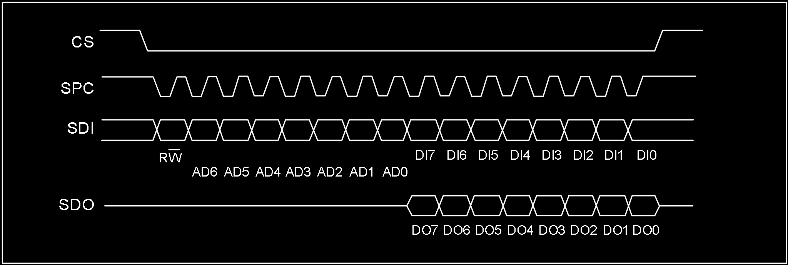

SPI read command completes in 16 clocks. Multi-byte reads add 8 more clock cycles per byte.

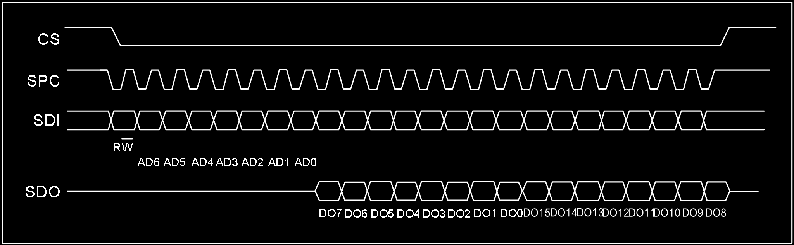

- Bit0: R/W control bit, set to 1
- Bit1-7: Address AD(6:0) is the register address
- Bit8-15: Data DO(7:0) (read mode), data read from slave device (MSB first)
- Bit16-...: Data DO(...:8) (read mode), additional data (MSB first)

#### 3.2.2 SPI Write

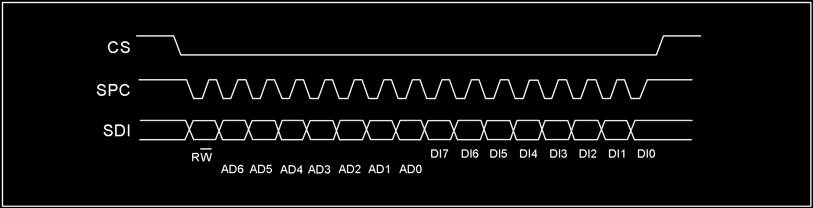

SPI single-byte write command completes in 16 clocks. Multi-byte writes add 8 more clock cycles per byte.

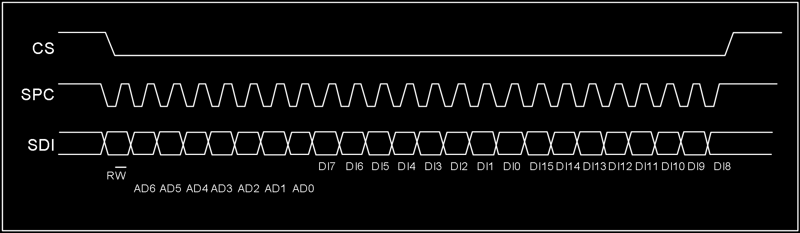

- Bit0: R/W control bit, set to 0
- Bit1-7: Address AD(6:0) is the register address
- Bit8-15: Data DI(7:0) (write mode), data written to slave device (MSB first)
- Bit16-...: Data DI(...:8) (write mode), additional data written (MSB first)

#### 3.2.3 SPI 3-Wire Mode Read

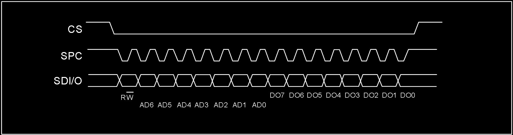

3-wire mode is configured by writing 1 to the SIM bit. 4-wire write and 3-wire write use only 3 signal lines with identical logic and timing, so 4-wire write configures the slave device to 3-wire mode first, then 3-wire mode access is used.

SPI read command completes in 16 clocks.

- Bit0: R/W control bit, set to 1
- Bit1-7: Address AD(6:0) is the register address
- Bit8-15: Data DO(7:0) (read mode), data read from slave device (MSB first)

When reading 3-axis FIFO data via SPI, start reading from register 0x0B, continuously read 7 bytes, and use the latter 6 bytes to assemble the 3-axis data. **Important:** Do not share SPC, MOSI, MISO across multiple SPI devices.

### 3.3 OIS Interface

The ICM-42688P supports optical image stabilization (OIS) applications via an auxiliary interface. This interface is used to access pre-filtered gyroscope and accelerometer data with minimum latency. Pre-filtered accelerometer data is available when ACC_ODR=1.6kHz; gyroscope data is available when GYR_ODR=6.4kHz. The OIS SPI interface supports 3-wire and 4-wire modes. The OIS SPI interface timing is the same as the main SPI interface.

---

## 4. Register Map

### 4.1 General-Purpose Registers

The following table lists the ICM-42688P general-purpose registers accessible via 8-bit addresses, their addresses, and default values.

| Name | Type | Register Address (Hex) | Register Address (Binary) | Default | Notes |
|---|---|---|---|---|---|
| WHO_AM_I | rw | 01 | 0000 0001 | 0x6A | -- |
| Reserved (do not modify) | -- | 02-03 | -- | -- | -- |
| OIS_CONF | rw | 04 | 0000 0100 | -- | -- |
| COM_CFG | rw | 05 | 0000 0101 | 0x50 | -- |
| INT_CFG1 | rw | 06 | 0000 0110 | -- | -- |
| INT_CFG2 | rw | 07 | 0000 0111 | -- | -- |
| HPF&LPF_CFG | rw | 08 | 0000 1000 | 0x80 | -- |
| DATA_STAT/DATA_STAT_OIS | r | 0B | 0000 1011 | -- | -- |
| ACC_XH/ACC_XH_OIS | r | 0C | 0000 1100 | -- | output |
| ACC_XL/ACC_XL_OIS | r | 0D | 0000 1101 | -- | output |
| ACC_YH/ACC_YH_OIS | r | 0E | 0000 1110 | -- | output |
| ACC_YL/ACC_YL_OIS | r | 0F | 0000 1111 | -- | output |
| ACC_ZH/ACC_ZH_OIS | r | 10 | 0001 0000 | -- | output |
| ACC_ZL/ACC_ZL_OIS | r | 11 | 0001 0001 | -- | output |
| GYR_XH/GYR_XH_OIS | r | 12 | 0001 0010 | -- | output |
| GYR_XL/GYR_XL_OIS | r | 13 | 0001 0011 | -- | output |
| GYR_YH/GYR_YH_OIS | r | 14 | 0001 0100 | -- | output |
| GYR_YL/GYR_YL_OIS | r | 15 | 0001 0101 | -- | output |
| GYR_ZH/GYR_ZH_OIS | r | 16 | 0001 0110 | -- | output |
| GYR_ZL/GYR_ZL_OIS | r | 17 | 0001 0111 | -- | output |
| TIME_H | r | 18 | 0001 1000 | -- | -- |
| TIME_M | r | 19 | 0001 1001 | -- | -- |
| TIME_L | r | 1A | 0001 1010 | -- | -- |
| FIFO_CFG0 | rw | 1C | 0001 1100 | -- | -- |
| FIFO_CFG1 | rw | 1D | 0001 1101 | 0x07 | -- |
| FIFO_CFG2 | rw | 1E | 0001 1110 | 0xFF | -- |
| FIFO_STAT0 | r | 1F | 0001 1111 | 0x40 | -- |
| FIFO_STAT1 | r | 20 | 0010 0000 | -- | -- |
| FIFO_DATA | r | 21 | 0010 0001 | -- | -- |
| TEMP_H | r | 22 | 0010 0010 | -- | -- |
| TEMP_L | r | 23 | 0010 0011 | -- | -- |
| AOI1_CFG | rw | 30 | 0011 0000 | -- | -- |
| AOI1_STAT | r | 31 | 0011 0001 | -- | -- |
| AOI1_THS | rw | 32 | 0011 0010 | -- | -- |
| AOI1_DURATION | rw | 33 | 0011 0011 | -- | -- |
| AOI2_CFG | rw | 34 | 0011 0100 | -- | -- |
| AOI2_STAT | r | 35 | 0011 0101 | -- | -- |
| AOI2_THS | rw | 36 | 0011 0110 | -- | -- |
| AOI2_DURATION | rw | 37 | 0011 0111 | -- | -- |
| CLICK_CRTL_REG | rw | 38 | 0011 1000 | -- | -- |
| CLICK_SRC | r | 39 | 0011 1001 | -- | -- |
| STEP_CFG | rw | 3A | 0011 1010 | 0x08 | -- |
| STEP_SRC | rw | 3B | 0011 1011 | -- | -- |
| STEP_COUNTER_L | r | 3C | 0011 1100 | -- | -- |
| STEP_COUNTER_H | r | 3D | 0011 1101 | -- | -- |
| AOI1&AOI2_CFG | rw | 3F | 0011 1111 | -- | -- |
| ACC_CONF | rw | 40 | 0100 0000 | 0xA8 | -- |
| ACC_RANGE | rw | 41 | 0100 0001 | 0x02 | -- |
| GYR_CONF | rw | 42 | 0100 0010 | 0xA9 | -- |
| GYR_RANGE | rw | 43 | 0100 0011 | -- | -- |
| FIFO_DOWNS | rw | 45 | 0100 0101 | 0x88 | -- |
| SOFT_RST | rw | 4A | 0100 1010 | -- | -- |
| ACC_SELF_TEST | rw | 6D | 0110 1101 | -- | -- |
| GRY_SELF_TEST | rw | 6F | 0110 1111 | -- | -- |
| PWR_CTRL | rw | 7D | 0111 1101 | -- | -- |
| SEG_SEL | rw | 7F | 0111 1111 | -- | -- |

**Note:** Registers marked "Reserved" must not be modified in use — doing so may cause permanent damage. Also, wait 1ms after register configuration before performing register read operations.

### 4.2 Special Register Bank 1

The following registers require writing 0x83 to register 0x7F (SEG_SEL) before access.

| Name | Type | Hex | Binary | Default | Notes |
|---|---|---|---|---|---|
| I2C_UN | rw | 6F | 0110 1111 | -- | -- |

**Note:** After special register configuration, write 0x00 to address 0x7F to return to general-purpose register access. Wait 1ms after configuration before reading registers.

### 4.3 Special Register Bank 2

The following registers require writing 0x8C to register 0x7F (SEG_SEL) before access.

| Name | Type | Hex | Binary | Default | Notes |
|---|---|---|---|---|---|
| DIG_CTRL | rw | 30 | 0011 0000 | -- | -- |

**Note:** After special register configuration, write 0x00 to address 0x7F to return to general-purpose register access. Wait 1ms after configuration before reading registers.

### 4.4 Special Register Bank 3

The following registers require writing 0x90 to register 0x7F (SEG_SEL) before access.

| Name | Type | Hex | Binary | Default | Notes |
|---|---|---|---|---|---|
| WRIST_SRC | rw | 3E | 0011 1110 | -- | -- |
| CLICK_COEFF1 | rw | 40 | 0100 0000 | 0x52 | -- |
| CLICK_COEFF2 | rw | 41 | 0100 0001 | 0x9A | -- |
| CLICK_COEFF3 | rw | 42 | 0100 0010 | 0x04 | -- |
| CLICK_COEFF4 | rw | 43 | 0100 0011 | 0x57 | -- |
| STEP_DELTA | rw | 44 | 0100 0100 | 0x01 | -- |
| STEP_WTM | rw | 45 | 0100 0101 | 0x01 | -- |
| PEDO_COEFF1 | rw | 46 | 0100 0110 | 0x4F | -- |
| PEDO_COEFF2 | rw | 47 | 0100 0111 | 0x23 | -- |
| PEDO_COEFF3 | rw | 48 | 0100 1000 | 0xA5 | -- |
| PEDO_COEFF4 | rw | 49 | 0100 1001 | 0x23 | -- |
| PEDO_COEFF5 | rw | 4A | 0100 1010 | 0x04 | -- |
| PEDO_COEFF6 | rw | 4B | 0100 1011 | 0x8C | -- |
| WRIST_CTRL1 | rw | 51 | 0101 0001 | 0x30 | -- |
| WRIST_CTRL2 | rw | 52 | 0101 0010 | 0x0F | -- |
| WRIST_CTRL3 | rw | 53 | 0101 0011 | 0x93 | -- |

**Note:** After special register configuration, write 0x00 to address 0x7F to return to general-purpose register access. Wait 1ms after configuration before reading registers.

Do not modify register contents during "boot startup" — these contain factory calibration and compensation data that is power-loss preserved and auto-loaded.

---

## 5. Register Descriptions

### 5.1 WHO_AM_I (01h)

| B7 | B6 | B5 | B4 | B3 | B2 | B1 | B0 |
|---|---|---|---|---|---|---|---|
| 0 | 1 | 1 | 0 | 1 | 0 | 1 | 0 |

**Note:** Equivalent to CHIP_ID = 0x6A.

### 5.2 OIS_CONF (04h)

| B7 | B6 | B5 | B4 | B3 | B2 | B1 | B0 |
|---|---|---|---|---|---|---|---|
| -- | -- | -- | OIS_EN | -- | -- | -- | -- |

- **OIS_EN:** OIS enable bit. Default: 0 (0: OIS disabled; 1: OIS enabled)

### 5.3 COM_CFG (05h)

| B7 | B6 | B5 | B4 | B3 | B2 | B1 | B0 |
|---|---|---|---|---|---|---|---|
| BOOT | BDU | -- | Addr_Auto | -- | OSIM | -- | SIM |

- **BOOT:** Reboot trim values. Default: 0 (0: Normal mode; 1: Reboot trim values — auto-resets to "0" after reboot)
- **BDU:** Block data update. Default: 0 (0: Continuous update; 1: Output data registers not updated until MSB and LSB are read)
- **Addr_Auto:** Communication address auto-increment control. Default: 1 (0: Address does not auto-increment — must be configured for FIFO_DATA continuous reading; 1: Address auto-increments during continuous read/write — suitable for I2C and SPI communication, OIS not applicable)
- **OSIM:** OIS SPI communication mode select. Default: 0 (0: OIS 4-wire mode; 1: OIS 3-wire mode)
- **SIM:** SPI serial interface mode configuration. Default: 0 (0: 4-wire interface; 1: 3-wire interface)

### 5.4 INT_CFG1 (06h)

| B7 | B6 | B5 | B4 | B3 | B2 | B1 | B0 |
|---|---|---|---|---|---|---|---|
| -- | INT_PP_OD | H_LACTIVE | INT1_SEL4 | INT1_SEL3 | INT1_SEL2 | INT1_SEL1 | INT1_SEL0 |

- **INT_PP_OD:** INT1 and INT2 push-pull or open-drain output select. Default: 0 (0: Push-pull output enable; 1: Open-drain output enable)
- **H_LACTIVE:** Interrupt pin default level control. Default: 0 (0: Interrupt triggers output high level — default low; 1: Interrupt triggers output low level — default high)

| INT1_SEL[4:0] | Description |
|---|---|
| 00001 | DRDY_ACC interrupt on INT1 |
| 00010 | DRDY_ACC_OIS interrupt on INT1 |
| 00011 | DRDY_GYR interrupt on INT1 |
| 00100 | DRDY_GYR_OIS interrupt on INT1 |
| 00101 | DRDY_TMP interrupt on INT1 |
| 00111 | CLICK interrupt on INT1 |
| 01000 | EMPTY interrupt on INT1 |
| 01001 | WTM interrupt on INT1 |
| 01010 | OVER_FIFO interrupt on INT1 |
| 01011 | AOI1 interrupt on INT1 |
| 01100 | AOI2 interrupt on INT1 |
| 01101 | AOI1\|AOI2 interrupt on INT1 |
| 01111 | WTM_STEP interrupt on INT1 |
| 10000 | DELTA_STEP interrupt on INT1 |
| 10001 | OVER_STEP interrupt on INT1 |
| 10010 | WRIST_FLAG interrupt on INT1 |
| 10011 | WRIST_ON_FLAG interrupt on INT1 |
| 10100 | WRIST_DOWN_FLAG interrupt on INT1 |
| 10101 | WRIST_ON_FLAG\|WRIST_DOWN_FLAG interrupt on INT1 |

### 5.5 INT_CFG2 (07h)

| B7 | B6 | B5 | B4 | B3 | B2 | B1 | B0 |
|---|---|---|---|---|---|---|---|
| -- | -- | -- | INT2_SEL4 | INT2_SEL3 | INT2_SEL2 | INT2_SEL1 | INT2_SEL0 |

| INT2_SEL[4:0] | Description |
|---|---|
| 00001 | DRDY_ACC interrupt on INT2 |
| 00010 | DRDY_ACC_OIS interrupt on INT2 |
| 00011 | DRDY_GYR interrupt on INT2 |
| 00100 | DRDY_GYR_OIS interrupt on INT2 |
| 00101 | DRDY_TMP interrupt on INT2 |
| 00111 | CLICK interrupt on INT2 |
| 01000 | EMPTY interrupt on INT2 |
| 01001 | WTM interrupt on INT2 |
| 01010 | OVER_FIFO interrupt on INT2 |
| 01011 | AOI1 interrupt on INT2 |
| 01100 | AOI2 interrupt on INT2 |
| 01101 | AOI1\|AOI2 interrupt on INT2 |
| 01111 | WTM_STEP interrupt on INT2 |
| 10000 | DELTA_STEP interrupt on INT2 |
| 10001 | OVER_STEP interrupt on INT2 |
| 10010 | WRIST_FLAG interrupt on INT2 |
| 10011 | WRIST_ON_FLAG interrupt on INT2 |
| 10100 | WRIST_DOWN_FLAG interrupt on INT2 |
| 10101 | WRIST_ON_FLAG\|WRIST_DOWN_FLAG interrupt on INT2 |

---

---

## 6D Orientation Detection

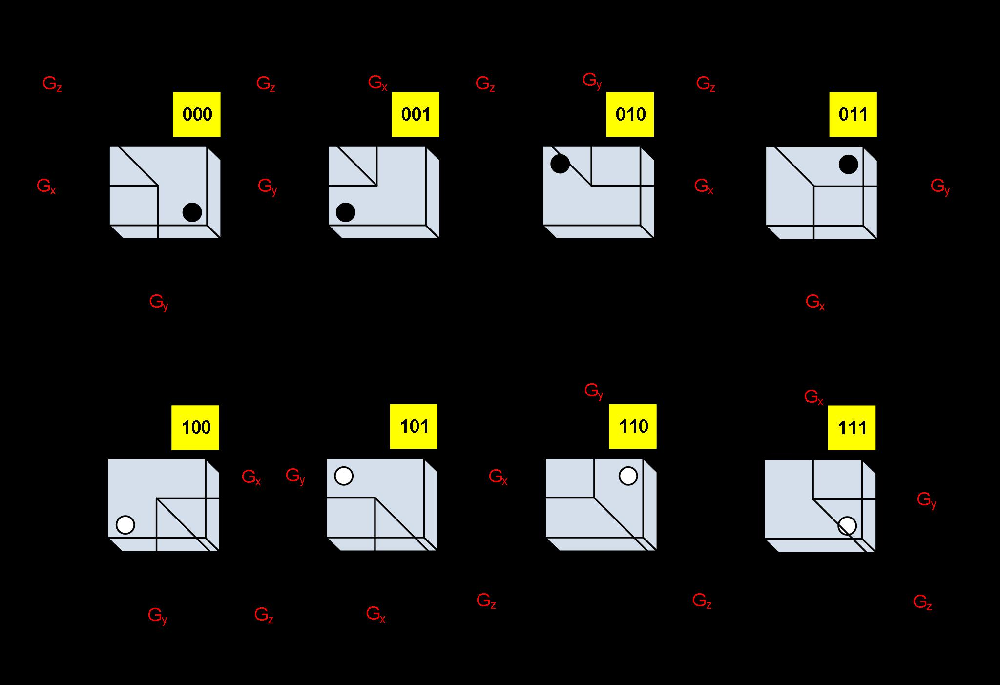

## Gyroscope Mounting Orientations

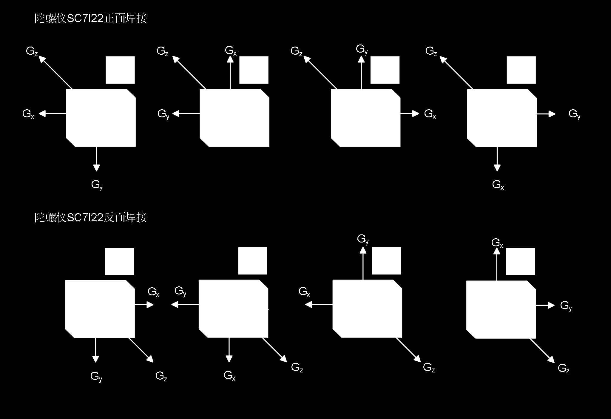

---

*Translated from Chinese datasheet by HuaXuanYang (HXY) Electronics. This is NOT the original InvenSense/TDK ICM-42688-P datasheet — it is a compatible/clone part from HXY with similar register interface. Original document: ICM-42688P-HXY.pdf*
