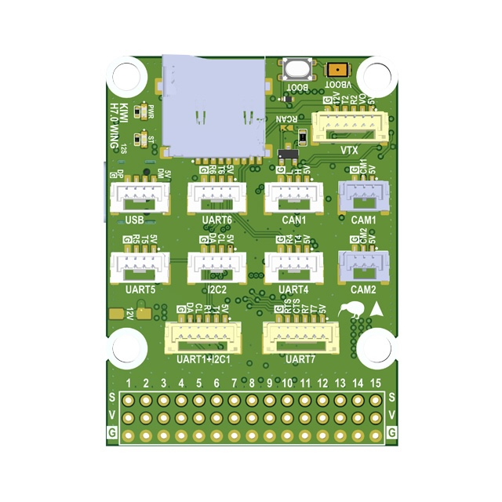
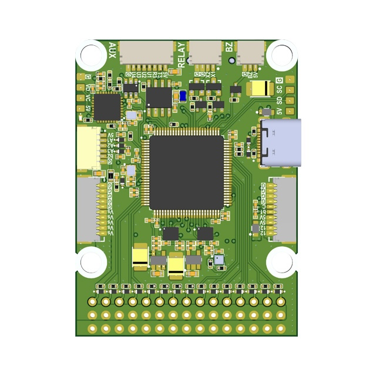
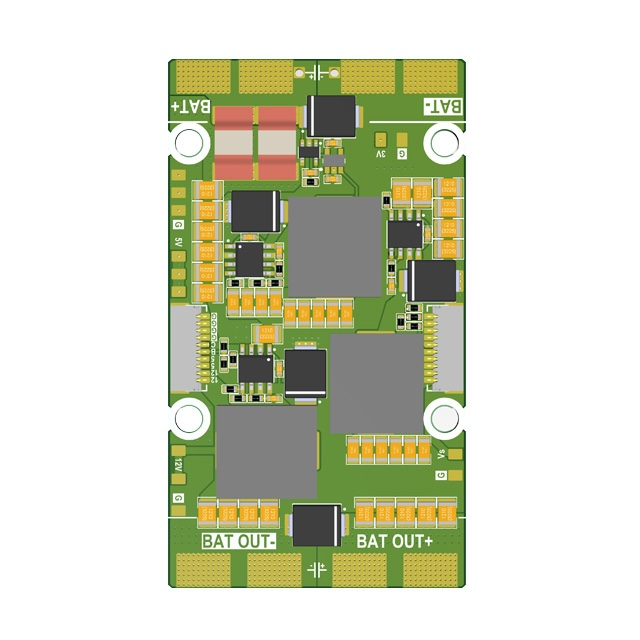
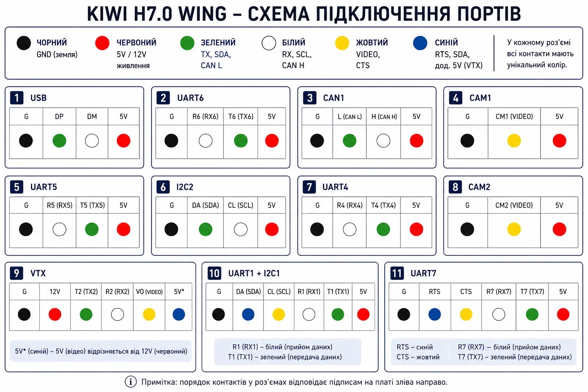

# KiwiH743-Wing Flight Controller





<a href="https://kiwidrone.com.ua/kiwi-pixwing-h743-12s/" target="_blank" class="buy-online">Buy Online</a>
<a href="https://kiwidrone.com.ua/kiwi-pixwing-h743-12s/" target="_blank" class="buy-online-sticky">Buy Online</a>

<nav class="quick-nav">
  <a href="#overview">Overview</a>
  <a href="#firmware">Firmware</a>
  <a href="#features">Features</a>
  <a href="#technical-specifications">Specs</a>
  <a href="#serial-ports">Serial Ports</a>
  <a href="#high-baud-mavlink-ports">High-baud MAVLink</a>
  <a href="#connectors-and-wire-colors">Connectors</a>
  <a href="#gpios-relays-and-aux">GPIOs & Relays</a>
  <a href="#power-monitoring">Power</a>
  <a href="#buses">Buses</a>
  <a href="#premium-features">Premium</a>
  <a href="#displayport-osd">OSD</a>
  <a href="#flight-controller">FC Board</a>
  <a href="#power-distribution-board-pdb">PDB</a>
  <a href="#full-pinout-reference">Pinout</a>
</nav>

## Overview

The **KiwiH743-Wing** is a Pixhawk-format flight controller system consisting of two boards: a Flight Controller and a Power Distribution Board (PDB). Designed for expendable quadcopters and long-range fixed-wing drones. Ready to use with Rover, Wing, Quadcopter, and Hexacopter configurations.

**Premium features:** GPS-less takeoff, IRC Tramp VTX control, VRX integration (TBS Fusion, Skyzone Steadyview).

---

## Firmware

| Firmware | Version | Updated | Download |
|---|---|---|---|
| ArduPilot 4.6 | 4.6.3-dev (e4a1d2cc) | 2026-06-26 | [KiwiH743-wing.zip](download/KiwiH743-wing.zip) |
| ArduPilot 4.5 | 4.5.7-dev (0edb016a) | 2026-06-28 | [KiwiH743-wing-4.5.zip](download/KiwiH743-wing-4.5.zip) |
| ArduPilot 4.6, no IMU CLKIN | 4.6.3-dev (5436f451) | 2026-05-15 | [KiwiH743-wing-noclkin.zip](download/KiwiH743-wing-noclkin.zip) |
| ArduPilot 4.5, no IMU CLKIN | TBD | TBD | TBD (`KiwiH743-wing-noclkin-4.5.zip`) |
| Betaflight | — | — | TBD |

The `noclkin` build is an A/B test control with the external 32.768 kHz IMU clock disabled — IMUs run on their internal oscillators. Same `APJ_BOARD_ID`, loads with the same bootloader.

> Both 4.5 (Plane-4.5.7 LTS) and 4.6 (current) ArduPilot branches are maintained in parallel. Pick the one that matches your fleet.

### Previous versions

| Firmware | Version | Updated | Download |
|---|---|---|---|
| ArduPilot 4.6 | 4.6.3-dev (5436f451) | 2026-05-20 | [KiwiH743-wing-2026-05-20.zip](download/old/KiwiH743-wing-2026-05-20.zip) |
| ArduPilot 4.5 | 4.5.7-dev (79b1a19b) | 2026-06-20 | [KiwiH743-wing-4.5-2026-06-20.zip](download/old/KiwiH743-wing-4.5-2026-06-20.zip) |

---

## Features

- STM32H743 MCU (480 MHz, 2 MB flash)
- 12S power supply
- 5V, 6/7V, 9/12V 5A BECs
- ICM-42688P and ICM-45686 with power and hardware signal filtering
- BMP388 barometer
- Dual camera input, switchable
- 8 motors + 7 servos (15 PWM outputs)
- 5 UARTs, UART7 with flow control
- 1 SPI, 1 I2C, FDCAN
- 5 GPIOs, 2 relay outputs, 9/12V switch
- Analog + digital VTX output
- STM32G4 OSD
- SD card via SDMMC
- 40 x 42 mm board, 36 x 39 mm mounting holes

---

## Technical Specifications

### Processor

| Parameter | Value |
|---|---|
| MCU | STM32H743 |
| Architecture | ARM Cortex-M7 |
| Max Frequency | 480 MHz |
| Flash | 2048 KB (2 MB) |
| Crystal | 16 MHz external oscillator |

### Sensors

| Sensor | Part | Notes |
|---|---|---|
| IMU 1 | ICM-42688P | External clock, hardware filtered |
| IMU 2 | ICM-45686 | Hardware filtered |
| Barometer | BMP388 | |
| OSD | STM32G4 | Analog video overlay |

### Power

| Rail | Voltage | Current |
|---|---|---|
| Input | 12S (up to ~50V) | |
| BEC 1 | 5V | 5A |
| BEC 2 | 6/7V | 5A |
| BEC 3 | 9/12V | 5A |

### Mechanical

| Parameter | Value |
|---|---|
| Board size | 39 x 39 mm |
| Mounting holes | 30.5 x 30.5 mm |

---

## Serial Ports

Ports without DMA fall back to interrupt + FIFO and are not deterministic at high baud.

| Serial   | UART   | TX Pin | RX Pin | DMA RX        | DMA TX | Notes                                          |
|----------|--------|--------|--------|---------------|--------|------------------------------------------------|
| Serial 1 | USART1 | PB14   | PB15   | NODMA         | DMA    | Low-rate only (≤115 k)                         |
| Serial 2 | USART2 | PD5    | PD6    | NODMA         | NODMA  | Low-rate only (≤115 k)                         |
| Serial 3 | USART3 | PD8    | PD9    | NODMA         | DMA    | Low-rate only (≤115 k)                         |
| Serial 4 | UART4  | PD1    | PD0    | DMA exclusive | DMA exclusive | ★ Rank 1 high-baud — first choice       |
| Serial 5 | UART5  | PB13   | PB12   | NODMA         | DMA    | Low-rate only (≤115 k)                         |
| Serial 6 | USART6 | PC6    | PC7    | NODMA         | DMA    | Low-rate only (≤115 k)                         |
| Serial 7 | UART7  | PE8    | PE7    | DMA exclusive | DMA exclusive | ★ Rank 2 high-baud; RTS PE9, CTS PE10  |
| Serial 8 | UART8  | PE1    | PE0    | NODMA         | DMA    | OSD UART                                       |

---

### High-baud MAVLink ports

For peripherals that need >115 k baud (e.g. ELRS+MAVLink, RTK GPS+MAVLink), use the DMA-backed UARTs:

| Rank | Serial   | UART  | TX Pin | RX Pin | Notes                                              |
|------|----------|-------|--------|--------|----------------------------------------------------|
| 1    | Serial 4 | UART4 | PD1    | PD0    | First choice for any high-baud peripheral          |
| 2    | Serial 7 | UART7 | PE8    | PE7    | Second choice. RTS/CTS wired — tie peripheral CTS to GND, or set `BRD_SER7_RTSCTS = 0` |

Default firmware already sets `SERIAL7_PROTOCOL = MAVLink2` on the Wing, so for a second high-baud link just set `SERIAL7_BAUD = 460`.

---

## Connectors and Wire Colors

Port connection diagram for cable assembly. Pin order in each connector matches the silkscreen labels on the board, read left to right.



| Port | Pin Order | Wire Colors |
|---|---|---|
| USB | G, DP, DM, 5V | Black, Green, White, Red |
| UART6 | G, R6, T6, 5V | Black, White, Green, Red |
| CAN1 | G, L, H, 5V | Black, Green, White, Red |
| CAM1 | G, CM1, 5V | Black, Yellow, Red |
| UART5 | G, R5, T5, 5V | Black, White, Green, Red |
| I2C2 | G, SDA, SCL, 5V | Black, Green, White, Red |
| UART4 | G, R4, T4, 5V | Black, White, Green, Red |
| CAM2 | G, CM2, 5V | Black, Yellow, Red |
| VTX | G, 12V, T2, R2, VO, 5V | Black, Red, Green, White, Yellow, Blue |
| UART1 + I2C1 | G, SDA, SCL, R1, T1, 5V | Black, Blue, Yellow, White, Green, Red |
| UART7 | G, RTS, CTS, R7, T7, 5V | Black, Blue, Yellow, White, Green, Red |

### Wire Color Legend

| Color | Signal |
|---|---|
| Black | Ground (GND) |
| Red | Power (5V / 12V) |
| Green | TX, CAN L, SDA |
| White | RX, CAN H, SCL |
| Yellow | Video (VO/CM) or CTS |
| Blue | RTS or auxiliary signal (used for the second power wire on the VTX cable) |

> **Note:** Wire colors are intended to simplify cable assembly and connector identification. Signal names printed on the PCB always take precedence over wire color. On the VTX cable, `5V` is the video 5V rail (blue) — distinct from `12V` (red).

---

## GPIOs, Relays, and AUX

### Dedicated GPIO Pads

| Pad      | Pin  | GPIO | Default    | ArduPilot Relay Config                |
|----------|------|------|------------|---------------------------------------|
| CAM SW   | PE2  | 100  | RELAY1     | `RELAY1_PIN=100` (hwdef default)      |
| RELAY 1  | PD3  | 101  | Output LOW | `RELAY2_PIN=101`, `RELAY2_FUNC=1`     |
| RELAY 2  | PD4  | 102  | Output LOW | `RELAY3_PIN=102`, `RELAY3_FUNC=1`     |
| AUX 1    | PD7  | 105  | Output LOW | `RELAY4_PIN=105`, `RELAY4_FUNC=1`     |
| AUX 2    | PB3  | 106  | Output LOW | `RELAY5_PIN=106`, `RELAY5_FUNC=1`     |
| AUX 3    | PE5  | 107  | Output LOW | —                                     |
| AUX 4    | PC13 | 103  | Output LOW | Shared with VIDEO BOOT                |
| VID NRST | PE3  | 104  | Output LOW | `RELAY6_PIN=104` (hwdef default), inverted |
| CAN SIL  | PE4  | 70   | Output LOW | CAN silent mode                       |
| BUZZER   | PA15 | 32   | Alarm      | —                                     |
| LED      | PD11 | 90   | Status LED | —                                     |

> **Note:** `RELAY1_PIN` defaults to GPIO 100 (Camera Switch, PE2). `RELAY6_PIN` defaults to GPIO 104 (VIDEO_NRST, PE3 — STM32G4 OSD reset, active low). RELAY 1/2 pads are 9/12V switched outputs.

### PWM Outputs

| Output   | Pin  | GPIO | Timer    | Function | DShot Bidir |
|----------|------|------|----------|----------|-------------|
| SERVO 1  | PA10 | 50   | TIM1_CH3 | Motor 1  | No          |
| SERVO 2  | PA9  | 51   | TIM1_CH2 | Motor 2  | No          |
| SERVO 3  | PA8  | 52   | TIM1_CH1 | Motor 3  | No          |
| SERVO 4  | PD15 | 53   | TIM4_CH4 | Servo 1  | No          |
| SERVO 5  | PD14 | 54   | TIM4_CH3 | Servo 2  | No          |
| SERVO 6  | PD13 | 55   | TIM4_CH2 | Servo 3  | No          |
| SERVO 7  | PD12 | 56   | TIM4_CH1 | Servo 4  | No          |
| SERVO 8  | PB1  | 57   | TIM3_CH4 | Servo 5  | No          |
| SERVO 9  | PB0  | 58   | TIM3_CH3 | Servo N  | No          |
| SERVO 10 | PB4  | 59   | TIM3_CH1 | Servo N  | No          |
| SERVO 11 | PB5  | 60   | TIM3_CH2 | Servo N  | No          |
| SERVO 12 | PA3  | 61   | TIM5_CH4 | Servo N  | No          |
| SERVO 13 | PA2  | 62   | TIM5_CH3 | Servo N  | No          |
| SERVO 14 | PA1  | 63   | TIM5_CH2 | Servo N  | No          |
| SERVO 15 | PA0  | 64   | TIM5_CH1 | Servo N  | No          |

PWM pins can be reassigned to GPIO via `SERVOn_FUNCTION=0` + `RELAYn_PIN=<gpio>`.

### Relay Usage

**MAVProxy:**
```
param set RELAY2_PIN 101
param set RELAY2_FUNC 1
relay set 0 1    # RELAY1 ON (CAM SW HIGH)
relay set 0 0    # RELAY1 OFF
relay set 1 1    # RELAY2 ON (RELAY1 pad HIGH)
```

**Mission waypoint:** `DO_SET_RELAY` — relay number 0-based (0=RELAY1), setting 1=ON / 0=OFF.

**Lua:**
```lua
relay:toggle(0)  -- toggle RELAY1 (CAM SW)
relay:on(1)      -- RELAY2 ON (RELAY1 pad)
relay:off(1)     -- RELAY2 OFF
```

All GPIO pads default LOW on boot. Use `RELAY_DEFAULT` params to set initial state.

**OSD Reset (RELAY6):**

RELAY6 controls the STM32G4 OSD reset line (VID NRST). Active low — set `RELAY6_INVERTED=1` so that "relay on" pulls the line low (reset) and "relay off" releases it.

```
param set RELAY6_PIN 104
param set RELAY6_FUNCTION 1
param set RELAY6_INVERTED 1
relay set 5 1   # reset OSD
relay set 5 0   # release reset
```

---

## Power Monitoring

| Function | Pin | ADC |
|---|---|---|
| Battery voltage | PC5 | ADC1 IN8, scale /21 |
| Battery current | PC4 | ADC1 IN4 |
| VBAT2 | PC3_C | ADC3 IN1, scale /21 |
| ADC 1 | PC1 | ADC1 IN11 |
| ADC 2 | PC0 | ADC1 IN10 |
| ADC 3 | PC2_C | ADC3 IN0 |

### Sensor Calibration

| Parameter | ArduPilot | Betaflight |
|-----------|-----------|------------|
| Voltage scale | `BATT_VOLT_MULT` = 21.0 | `voltage_meter_scale` = 210 |
| Current scale | `BATT_AMP_PERVLT` = 142.9 | `current_meter_scale` = 100 |

### Battery Voltage Thresholds (ArduPilot)

| Parameter | 6S | 8S | 12S |
|-----------|-----|-----|------|
| Full charge | 25.2 V | 33.6 V | 50.4 V |
| `BATT_ARM_VOLT` | 22.2 | 29.6 | 44.4 |
| `BATT_LOW_VOLT` | 21.0 | 28.0 | 42.0 |
| `BATT_CRT_VOLT` | 19.8 | 26.4 | 39.6 |

---

## Buses

### SPI

| Bus | CLK | MISO | MOSI | Usage |
|---|---|---|---|---|
| SPI 1 | PA5 | PA6 | PA7 | IMU 1 (CS: PB2) |
| SPI 4 | PE12 | PE13 | PE14 | IMU 2 (CS: PE15) |

### I2C

| Bus | SCL | SDA |
|---|---|---|
| I2C 1 | PB6 | PB7 |
| I2C 2 | PB10 | PB11 |

### FDCAN

| Function | Pin |
|---|---|
| CAN RX | PB8 |
| CAN TX | PB9 |
| CAN Silent | PE4 |

### SDMMC (SD Card)

| Function | Pin |
|---|---|
| D0 | PC8 |
| D1 | PC9 |
| D2 | PC10 |
| D3 | PC11 |
| CLK | PC12 |
| CMD | PD2 |

---

## Premium Features

### GPS-less Takeoff (ArduPlane)

KIWI firmware supports autonomous takeoff without a GPS fix. Useful for hand launch or catapult deployment in GPS-denied environments.

**Parameters:**

| Parameter | Value | Description |
|-----------|-------|-------------|
| `FLIGHT_OPTIONS` | 32768 | Enable GPS-less takeoff |
| `ARMING_CHECK` | 0 | Disable arming checks |
| `TKOFF_ALT` | 50 | Target takeoff altitude (meters) |
| `TKOFF_THR_MINACC` | 0 | No accelerometer trigger, timer only |
| `TKOFF_THR_MINSPD` | 0 | No minimum ground speed required |
| `TKOFF_THR_MAX` | 100 | Max throttle % during takeoff |
| `TKOFF_THR_DELAY` | 2 | Delay before launch (0.2s) |

**Procedure:**

1. Power on, wait for EKF convergence
2. Set home (from GPS before loss, or manually via MAVLink)
3. Arm in FBWA mode
4. Switch to TAKEOFF mode

### IRC Tramp VTX Control

Full IRC Tramp protocol support under ArduPilot. Change VTX power, band, channel, and pit mode directly from your GCS or OSD — no need for SmartAudio.

Works with TBS Unify, Rush Tank, and other Tramp-compatible VTXs.

### VRX Integration (TBS Fusion / Skyzone)

Working video receiver control under ArduPilot. Supports:

- **TBS Fusion** — band/channel tracking via CRSF
- **Skyzone Steadyview** — auto channel sync

### Camera Gimbal Support

KiwiH743-Wing supports camera gimbals out of the box — both servo-based and MAVLink protocol gimbals (CADDX GM3 V2 and compatible).

#### MAVLink Gimbal

Wire gimbal UART to any free serial port (gimbal TX → FC RX, gimbal RX → FC TX, GND).

| Param | Value | Notes |
|-------|-------|-------|
| `SERIALx_PROTOCOL` | 2 | MAVLink2 |
| `SERIALx_BAUD` | 115 | 115200 bps |
| `MNT1_TYPE` | 6 | Gremsy (reboot after setting) |
| `MNT1_PITCH_MIN` | -120 | GM3 V2 spec: ±120° |
| `MNT1_PITCH_MAX` | 120 | |
| `MNT1_YAW_MIN` | -160 | GM3 V2 spec: ±160° |
| `MNT1_YAW_MAX` | 160 | |
| `MNT1_RC_RATE` | 60 | deg/s for rate control, 0 for angle |

##### RC Control

Assign RC channels to control gimbal axes:

| Param | Value | Notes |
|-------|-------|-------|
| `RC6_OPTION` | 213 | Mount1 Pitch |
| `RC7_OPTION` | 214 | Mount1 Yaw |
| `RC8_OPTION` | 212 | Mount1 Roll (3-axis gimbals only) |

Example: with `MNT1_RC_RATE=60`, moving the RC6 stick deflects pitch at 60°/s. Set `MNT1_RC_RATE=0` for direct angle control (stick position = gimbal angle).

> Gimbal firmware must be V2.0 or higher.

#### Servo Gimbal

Connect pitch/yaw servos to any Servo PWM outputs (SERVO 9–SERVO 15).

| Param | Value | Notes |
|-------|-------|-------|
| `MNT1_TYPE` | 1 | Servo |
| `SERVOx_FUNCTION` | 6 | Mount1 Pitch (assign to desired output) |
| `SERVOx_FUNCTION` | 8 | Mount1 Yaw (assign to desired output) |
| `MNT1_PITCH_MIN` | -90 | |
| `MNT1_PITCH_MAX` | 90 | |
| `MNT1_YAW_MIN` | -170 | |
| `MNT1_YAW_MAX` | 170 | |
| `MNT1_RC_RATE` | 60 | deg/s for rate control, 0 for angle |

---

## Displayport OSD

HD OSD via MSP Displayport on SERIAL8 (OSD UART). Compatible with DJI O3, HDZero, Walksnail.

```
param set OSD_TYPE 5
param set OSD_UNITS 0
param set MSP_OPTIONS 4
param set MSP_OSD_NCELLS 0
param set SERIAL8_BAUD 115
param set SERIAL8_OPTIONS 0
param set SERIAL8_PROTOCOL 42
```

---

## Flight Controller

Built around the STM32H743, the flight controller provides dual IMUs with hardware signal filtering, dual switchable camera inputs, and relay-controlled power outputs.

---

## Power Distribution Board (PDB)

### Features

- 4S–12S power input
- 5V 5A output
- 5/6/7/9V 5A adjustable output
- 12V 5A output
- 3.3V 1A output
- 0.1 mOhm current sensor
- 36 x 39 mm mounting holes
- 42 x 75 mm board dimensions

---

## Other

| Function | Pin | Notes |
|---|---|---|
| USB D- | PA11 | |
| USB D+ | PA12 | |
| SWDIO | PA13 | Debug |
| SWDCLK | PA14 | Debug |
| Buzzer | PA15 | TIM2 CH1 |
| LED | PD11 | Status |
| IMU clock | PE6 | TIM15 CH2, external clock for IMUs |
| Video NRST | PE3 | OSD/VTX reset |
| Video BOOT | PC13 | Shared with AUX 4 |

---

## Full Pinout Reference

### Port A (PA)

| Pin | Function | Alternate |
|---|---|---|
| PA0 | SERVO 15 | TIM5 CH1 |
| PA1 | SERVO 14 | TIM5 CH2 |
| PA2 | SERVO 13 | TIM5 CH3 |
| PA3 | SERVO 12 | TIM5 CH4 |
| PA4 | IMU 1 INT | |
| PA5 | SPI 1 CLK | |
| PA6 | SPI 1 MISO | |
| PA7 | SPI 1 MOSI | |
| PA8 | SERVO 3 | |
| PA9 | SERVO 2 | |
| PA10 | SERVO 1 | |
| PA11 | USB N | |
| PA12 | USB P | |
| PA13 | SWDIO | |
| PA14 | SWDCLK | |
| PA15 | BUZZER | TIM2 CH1 |

### Port B (PB)

| Pin | Function | Alternate |
|---|---|---|
| PB0 | SERVO 9 | |
| PB1 | SERVO 8 | ADC1 IN5 |
| PB2 | IMU 1 CS | |
| PB3 | AUX 2 | |
| PB4 | SERVO 10 | |
| PB5 | SERVO 11 | |
| PB6 | I2C 1 SCL | |
| PB7 | I2C 1 SDA | |
| PB8 | FDCAN RX | TIM16 CH1 |
| PB9 | FDCAN TX | TIM17 CH1 |
| PB10 | I2C 2 SCL | |
| PB11 | I2C 2 SDA | |
| PB12 | Serial 5 RX | |
| PB13 | Serial 5 TX | |
| PB14 | Serial 1 TX | |
| PB15 | Serial 1 RX | |

### Port C (PC)

| Pin | Function | Alternate |
|---|---|---|
| PC0 | ADC 2 | ADC1 IN10 |
| PC1 | ADC 1 | ADC1 IN11 |
| PC2_C | ADC 3 | ADC3 IN0 |
| PC3_C | VBAT2 / 21 | ADC3 IN1 |
| PC4 | ESC CURR | ADC1 IN4 |
| PC5 | VBAT / 21 | ADC1 IN8 |
| PC6 | Serial 6 TX | TIM3 CH1 |
| PC7 | Serial 6 RX | TIM3 CH2 |
| PC8 | SDMMC D0 | TIM3 CH3 |
| PC9 | SDMMC D1 | TIM3 CH4 |
| PC10 | SDMMC D2 | |
| PC11 | SDMMC D3 | |
| PC12 | SDMMC CK | |
| PC13 | VIDEO BOOT / AUX 4 | |

### Port D (PD)

| Pin | Function | Alternate |
|---|---|---|
| PD0 | Serial 4 RX | |
| PD1 | Serial 4 TX | |
| PD2 | SDMMC CMD | |
| PD3 | RELAY 1 | |
| PD4 | RELAY 2 | |
| PD5 | Serial 2 TX | |
| PD6 | Serial 2 RX | |
| PD7 | AUX 1 | |
| PD8 | Serial 3 TX | |
| PD9 | Serial 3 RX | |
| PD11 | LED | |
| PD12 | SERVO 7 | TIM4 CH1 |
| PD13 | SERVO 6 | TIM4 CH2 |
| PD14 | SERVO 5 | TIM4 CH3 |
| PD15 | SERVO 4 | TIM4 CH4 |

### Port E (PE)

| Pin | Function | Alternate |
|---|---|---|
| PE0 | Serial 8 RX | |
| PE1 | Serial 8 TX | |
| PE2 | CAMERA SWITCH | |
| PE3 | VIDEO NRST | |
| PE4 | FDCAN SILENT | |
| PE5 | AUX 3 | TIM15 CH1 |
| PE6 | IMU CLK IN | TIM15 CH2 |
| PE7 | Serial 7 RX | |
| PE8 | Serial 7 TX | |
| PE9 | Serial 7 RTS | |
| PE10 | Serial 7 CTS | |
| PE11 | IMU 2 INT | TIM1 CH2 |
| PE12 | SPI 4 CLK | TIM1 CH2 |
| PE13 | SPI 4 MISO | TIM1 CH3 |
| PE14 | SPI 4 MOSI | TIM1 CH4 |
| PE15 | IMU 2 CS | |
